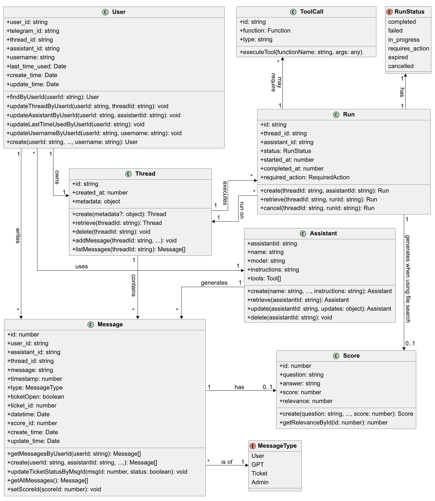
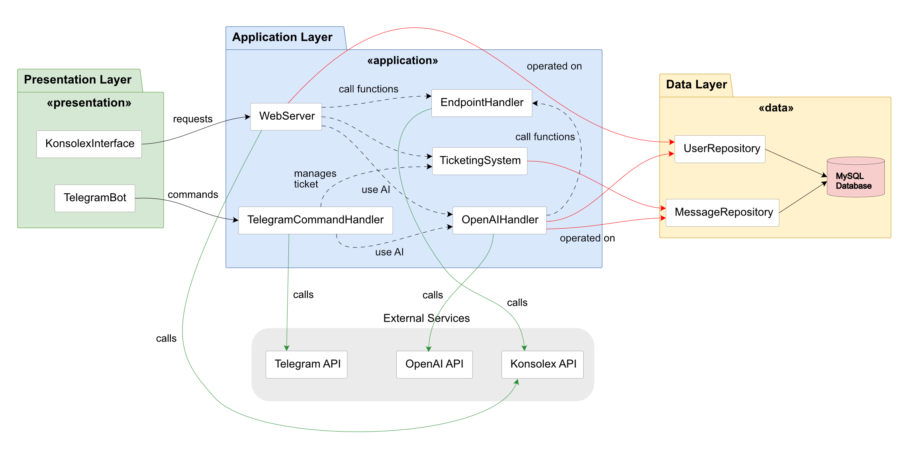
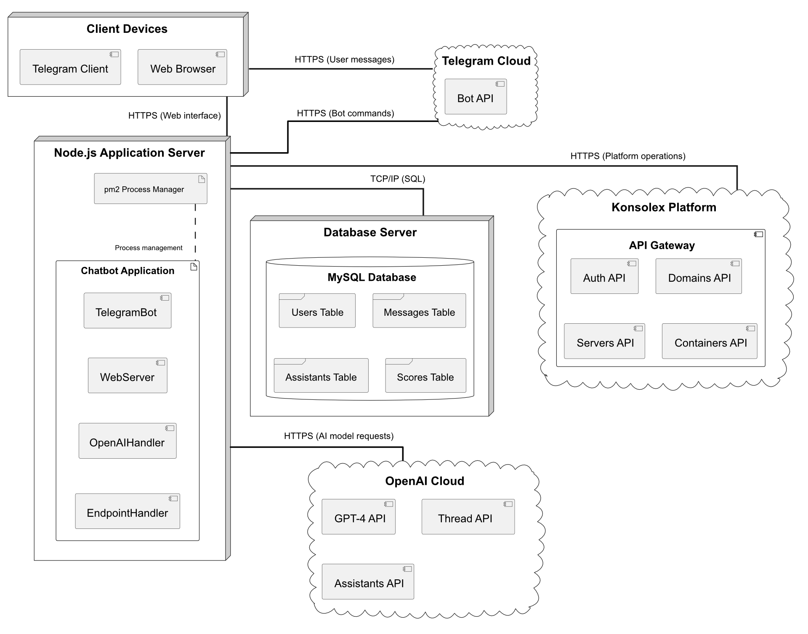
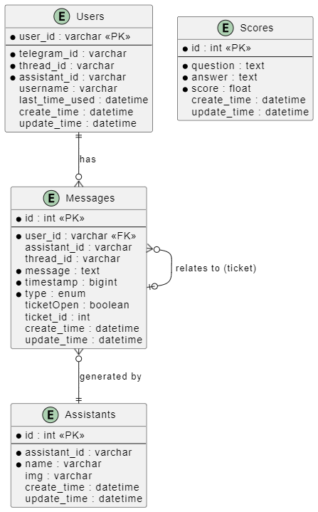

# Capitolo 5: Architettura del Sistema

Questo capitolo illustra l'architettura complessiva del sistema del chatbot AI per il supporto tecnico, descrivendo in dettaglio i componenti principali, le loro interazioni e le scelte strutturali che hanno guidato lo sviluppo.
L'architettura è stata progettata per garantire modularità, manutenibilità ed estensibilità, consentendo al sistema di evolvere in risposta a nuove esigenze o tecnologie.

## 5.1 Overview dell'Architettura Complessiva

Il sistema è stato progettato secondo un'architettura a microservizi modulare, con componenti loosely-coupled che comunicano attraverso interfacce ben definite. L'architettura complessiva è organizzata in tre livelli principali:

1. **Livello di Presentazione**: Gestisce le interazioni con gli utenti attraverso l'interfaccia di Konsolex, principalmente, e con l'interfaccia di Telegram.

2. **Livello Applicativo**: Contiene la logica di business, l'elaborazione AI delle richieste e l'orchestrazione delle operazioni sia amministrative che lato client.

3. **Livello Dati**: Gestisce la persistenza delle informazioni e l'accesso ai dati esterni tramite API.

La separazione di questi livelli garantisce che modifiche in una parte del sistema non influenzino necessariamente le altre, permettendo evoluzione e manutenzione indipendenti.

Il file `index.ts` fornisce il punto di ingresso principale dell'applicazione, inizializzando i componenti fondamentali e orchestrando l'avvio del sistema.

## 5.2 Moduli Principali e Loro Interazioni

Il sistema è composto da diversi moduli principali che collaborano per fornire le funzionalità complete. Questa organizzazione modulare facilita la manutenzione, il testing e l'estensione del sistema.

### 5.2.1 Web Server & REST API

Definito in `web-server.ts`, questo modulo espone API REST per l'interazione con il frontend amministrativo e quello lato client, supportando funzioni di monitoraggio e gestione.

### 5.2.2 OpenAI Handler

Il modulo OpenAI Handler, definito principalmente in `openai-handlers.ts` e `openai-tool.ts`, si occupa dell'integrazione con l'API OpenAI, gestendo thread conversazionali, richieste di function calling e interpretazione delle risposte AI.

### 5.2.3 Endpoint Handler

Questo modulo, implementato in `endpoint.ts`, fornisce un'astrazione per le interazioni con le API esterne di Konsolex, permettendo al sistema di eseguire operazioni tecniche come riavvio server, gestione domini e altre funzioni amministrative.

### 5.2.4 Sistema di Ticketing

Implementato in `ticketsCashe.ts` e correlati, gestisce il ciclo di vita dei ticket di supporto, inclusa creazione, tracciamento stato e risoluzione.

### 5.2.5 Telegram Bot

Implementato nei file `bot.ts` e `admin-commmand.ts`, questo modulo gestisce l'interfaccia utente tramite Telegram, processando i comandi e inviando risposte formattate. È il punto di contatto alternativo tra gli utenti e il sistema, che permette algi utenti di utilizzare il sistema da remoto.

### 5.2.6 Data Repositories

Rappresentati dai file nella directory `repositories`, questi componenti implementano il pattern Repository per fornire un'astrazione sull'accesso ai dati persistenti.

### 5.2.7 Interazioni tra Moduli

I moduli comunicano attraverso interfacce ben definite, riducendo l'accoppiamento e aumentando la testabilità. Ad esempio, quando un messaggio arriva tramite Telegram:

1. Il Bot riceve il messaggio
2. La funzione `storeMessageAndCreateReply` in `aux-functions.ts` gestisce la persistenza e l'elaborazione
3. OpenAI Handler genera una risposta utilizzando l'API GPT-4
4. Se necessario, vengono chiamate funzioni specifiche attraverso l'Endpoint Handler
5. La risposta viene formattata e inviata all'utente

Questa separazione di responsabilità segue il principio Single Responsibility e facilita l'evoluzione indipendente dei componenti.

## 5.3 Diagrammi Architetturali

### 5.3.1 Diagramma delle Classi

Il diagramma delle classi illustra le principali entità del sistema e le loro relazioni, evidenziando la struttura statica dell'architettura software.

Le principali classi del sistema includono:

- **User**: Rappresenta un utente del sistema con attributi come `user_id`, `telegram_id`, e `thread_id`. Offre funzionalità per la gestione degli utenti, inclusi metodi per trovare, aggiornare e creare profili utente.

- **Message**: Modella i messaggi scambiati nella piattaforma, differenziati per tipologia (utente, GPT, ticket, admin). Include attributi come `message`, `timestamp`, e `ticketOpen`. Consente l'accesso ai messaggi di un utente e la gestione dello stato dei ticket.

- **Assistant**: Gestisce un assistente virtuale con attributi come `name`, `img`, e `tools`. Fornisce funzionalità per la ricerca degli assistenti nel sistema. Nello stato attuale sono presenti solo due assistenti: uno per l'ambiente di test e uno per la gestione dei client.

- **Score**: Memorizza metriche di valutazione delle risposte AI, con attributi come `question`, `answer`, e `relevance`. Permette di calcolare gli score delle risposte dell'AI in base alle domanda del client.

- **Thread**: Gestisce i thread conversazionali di OpenAI, con attributi come `id`, `user_id`, e `expired`. Offre metodi per la creazione, l'aggiunta di messaggi e il reset del thread. Usato per tenere l'attenzione dell'assistente attiva.

- **Run**: Rappresenta un'esecuzione di un assistant su un thread, con attributi come `status`, `tool_calls`, e `required_action`. Implementa la logica per avviare l'esecuzione, recuperare risposte e gestire le chiamate agli strumenti.

- **ToolCall**: Richiama le richieste di esecuzione di funzioni specifiche da parte dell'AI, con attributi come `function` e `type`. Fornisce il metodo `executeTool` per l'esecuzione di operazioni concrete.

Il sistema utilizza anche enumerazioni come **MessageType** (User, GPT, Ticket, Admin) e **RunStatus** (completed, failed, in_progress, requires_action, expired, cancelled) per gestire gli stati e le tipologie di entità.

Le relazioni chiave tra queste classi riflettono la struttura logica del dominio:

- Un utente possiede un thread e può scrivere molti messaggi
- Un thread contiene molti messaggi ed esegue molte run
- Un assistant processa molte run e genera molti messaggi
- Una run può richiedere molti tool call e generare uno score quando utilizza la ricerca nei file
- Un messaggio può avere opzionalmente uno score di rilevanza
- I messaggi di ticket possono essere correlati tra loro

Questa organizzazione orientata agli oggetti riflette le entità principali del sistema OpenAI (thread, run, assistant) integrate con le entità specifiche dell'applicazione (user, message, score), creando un'architettura coesa che supporta il flusso conversazionale e l'esecuzione di operazioni tecniche.

### 5.3.2 Diagramma dei Componenti

Il diagramma dei componenti visualizza i blocchi funzionali del sistema e le loro dipendenze.

Il diagramma evidenzia come:
- Il TelegramBot dipenda dall'OpenAIHandler per le risposte
- L'OpenAIHandler utilizzi i repository per persistenza e l'EndpointHandler per operazioni tecniche
- Il WebServer fornisca interfacce amministrative e client
- I repository condividano l'accesso al database sottostante

Questa organizzazione componente-dipendenza supporta l'inversione del controllo e facilita il testing dei singoli moduli.

### 5.3.3 Diagramma di Deployment

Il diagramma di deployment illustra la distribuzione fisica del sistema su diversi nodi hardware e servizi cloud, evidenziando come i componenti architetturali siano allocati nell'infrastruttura operativa.

L'architettura di deployment è organizzata attorno a cinque nodi principali:

- **Node.js Application Server**: Ospita l'applicazione principale, comprendendo i componenti dell'Application Layer come OpenAIHandler, EndpointHandler, WebServer, TelegramCommandHandler e il sistema di ticketing. Questo server gestisce tutta la logica applicativa, le interazioni con le API esterne e il coordinamento dei flussi di comunicazione.

- **MySQL Database Server**: Fornisce la persistenza dei dati attraverso un database relazionale che memorizza informazioni su utenti, messaggi, thread conversazionali e valutazioni delle risposte. I repository implementati nel sistema accedono a questo database tramite interfacce ben definite.

- **API Gateway**: Funge da intermediario tra l'applicazione e i servizi esterni di Konsolex, gestendo autenticazione, routing e trasformazione delle richieste. Questo componente è cruciale per l'integrazione con l'ecosistema esistente di OnTheCloud.

- **Telegram API Cloud**: Gestisce tutte le comunicazioni con la piattaforma Telegram, permettendo l'interazione con gli utenti tramite l'interfaccia di messaggistica. Il sistema vi si connette tramite il TelegramBot e il TelegramCommandHandler.

- **OpenAI Cloud Services**: Fornisce le capacità di intelligenza artificiale attraverso l'API OpenAI, elaborando i messaggi degli utenti, generando risposte contestuali e gestendo thread conversazionali complessi.

La comunicazione tra questi nodi avviene principalmente tramite protocolli HTTP/HTTPS, con connessioni sicure e autenticate per garantire l'integrità e la riservatezza dei dati scambiati. Per ottimizzare le prestazioni, il sistema utilizza connessioni persistenti al database e implementa meccanismi di caching per ridurre la latenza nelle interazioni con i servizi esterni.

L'architettura di deployment è stata progettata tenendo conto dei requisiti di alta disponibilità e scalabilità, con la possibilità di implementare load balancing tra multiple istanze dell'Application Server e replicazione del database per garantire continuità di servizio anche in caso di guasti hardware.

### 5.3.4 Diagramma ER del Database

Il diagramma Entity-Relationship modella la struttura del database che supporta il sistema.

Le principali entità del database includono:
- **Users**: Utenti registrati con riferimenti ai loro thread OpenAI
- **Messages**: Messaggi scambiati nella piattaforma
- **Assistants**: Configurazioni degli assistenti virtuali
- **Scores**: Valutazioni delle risposte AI

Le relazioni tra queste entità riflettono i vincoli di integrità referenziale necessari per mantenere la coerenza dei dati.

## 5.4 Flussi di Dati e Comandi

### 5.4.1 Flusso di Conversazione Utente

Il flusso di dati tipico per una conversazione utente segue questo percorso:

1. L'utente invia un messaggio tramite la piattaforma Konsolex
2. Il messaggio viene salvato nel database tramite `user-repository.ts`
3. OpenAIHandler processa il messaggio nel contesto del thread conversazionale esistente
4. Se necessario, vengono eseguite operazioni tramite function calling verso l'Endpoint Handler
5. La risposta generata viene persistita e inviata all'utente

### 5.4.2 Flusso di Escalation

Quando una richiesta richiede intervento umano:

1. L'AI riconosce la necessità di escalation o l'utente la richiede esplicitamente
2. Un ticket viene creato tramite `sendMessageToAdmin` in `endpoint.ts`
3. Il ticket viene notificato agli admin tramite Telegram e interfaccia web
4. L'operatore risponde tramite l'interfaccia amministrativa
5. La risposta viene inviata all'utente tramite il canale originale

### 5.4.3 Flusso di Operazioni Tecniche

Quando è richiesta un'operazione tecnica:

1. L'AI identifica l'operazione necessaria tramite function calling
2. La funzione corrispondente viene invocata nell'Endpoint Handler
3. L'Endpoint Handler interagisce con l'API Konsolex
4. Il risultato viene restituito all'AI per formulare una risposta appropriata
5. L'utente riceve conferma dell'operazione eseguita

## 5.5 Pattern di Progettazione Adottati

L'architettura del sistema incorpora diversi pattern di progettazione consolidati che migliorano modularità, manutenibilità ed estensibilità.

### 5.5.1 Repository Pattern

Il pattern Repository, implementato nei file della directory `repositories`, fornisce un'astrazione dell'accesso ai dati che disaccoppia la logica di business dalla persistenza. Questo permette:

- Centralizzazione della logica di accesso ai dati
- Facilità di cambio del meccanismo di persistenza
- Miglior testabilità con mock repositories

L'implementazione in `user-repository.ts` e `message-repository.ts` dimostra questa separazione tra logica di dominio e persistenza.

### 5.5.2 Factory Pattern

Il pattern Factory è utilizzato per la creazione di istanze complesse, come nell'inizializzazione degli assistenti OpenAI. Questo pattern centralizza la creazione di oggetti e nasconde la complessità di inizializzazione.

### 5.5.3 Adapter Pattern

Il pattern Adapter è evidente nell'integrazione con API esterne come OpenAI e Konsolex, dove il sistema adatta le diverse interfacce esterne a un'interfaccia coerente utilizzata internamente.

### 5.5.4 Command Pattern

Il sistema di function calling implementa una variante del pattern Command, permettendo all'AI di richiedere l'esecuzione di operazioni specifiche attraverso un'interfaccia standardizzata. Questo è particolarmente evidente nella funzione `executeTool` in `openai-handlers.ts`.

### 5.5.5 Observer Pattern

Un meccanismo observer-like è utilizzato per le notifiche di aggiornamenti e per il tracciamento dello stato dei ticket, permettendo a diversi componenti di reagire a cambiamenti di stato senza accoppiamento diretto.

## 5.6 Considerazioni su Scalabilità e Manutenibilità

L'architettura è stata progettata con particolare attenzione alla scalabilità e manutenibilità, aspetti cruciali per un sistema destinato a crescere nel tempo.

### 5.6.1 Scalabilità Orizzontale

Il sistema è progettato per supportare la scalabilità orizzontale attraverso:

- **Statelessness**: Minimizzazione dello stato dell'applicazione
- **Separazione Database**: Il database può essere scalato indipendentemente dall'applicazione
- **Componenti Disaccoppiati**: Possibilità di scalare singoli componenti in base al carico

### 5.6.2 Manutenibilità del Codice

La manutenibilità è garantita da:

- **Struttura Modulare**: Organizzazione logica in componenti con responsabilità ben definite
- **Codice Fortemente Tipizzato**: TypeScript fornisce controlli statici e documentazione implicita
- **Pattern Consistenti**: Adozione di pattern di progettazione standard facilita la comprensione
- **Separation of Concerns**: Chiara separazione tra presentazione, logica di business e accesso dati

### 5.6.3 Estensibilità

L'architettura supporta estensioni future come:

- **Nuove Interfacce Utente**: Possibilità di aggiungere canali oltre Telegram
- **Funzionalità Aggiuntive**: Il sistema di function calling facilita l'aggiunta di nuove operazioni
- **Integrazione con Altri Servizi**: La struttura modulare facilita l'integrazione con servizi aggiuntivi

### 5.6.4 Monitorabilità

Il sistema include considerazioni per il monitoraggio:

- **Logging Strutturato**: Implementato per tracciare operazioni e diagnosticare problemi
- **Metriche di Performance**: Punti di misurazione per tempi di risposta e altri KPI
- **Tracciamento Errori**: Gestione centralizzata degli errori per facilitare la diagnosi

## 5.7 Conclusioni Architetturali

L'architettura del sistema chatbot AI rappresenta un bilanciamento tra principi di design moderno del software e requisiti pratici di un'applicazione di supporto tecnico. La combinazione di pattern di progettazione consolidati, modularità e integrazione con tecnologie all'avanguardia come OpenAI GPT-4 ha prodotto un sistema resiliente, estensibile e manutenibile.

La separazione dei componenti in moduli con responsabilità specifiche facilita non solo la manutenzione corrente ma anche l'evoluzione futura del sistema, permettendo l'adozione di nuove tecnologie o l'estensione delle funzionalità esistenti con minimo impatto sull'architettura complessiva.

L'approccio architetturale adottato riflette la filosofia di "anticipare il cambiamento" tipica dell'ingegneria del software moderna, creando un sistema che non solo risponde ai requisiti attuali ma è pronto ad evolvere con le esigenze future dell'organizzazione.
