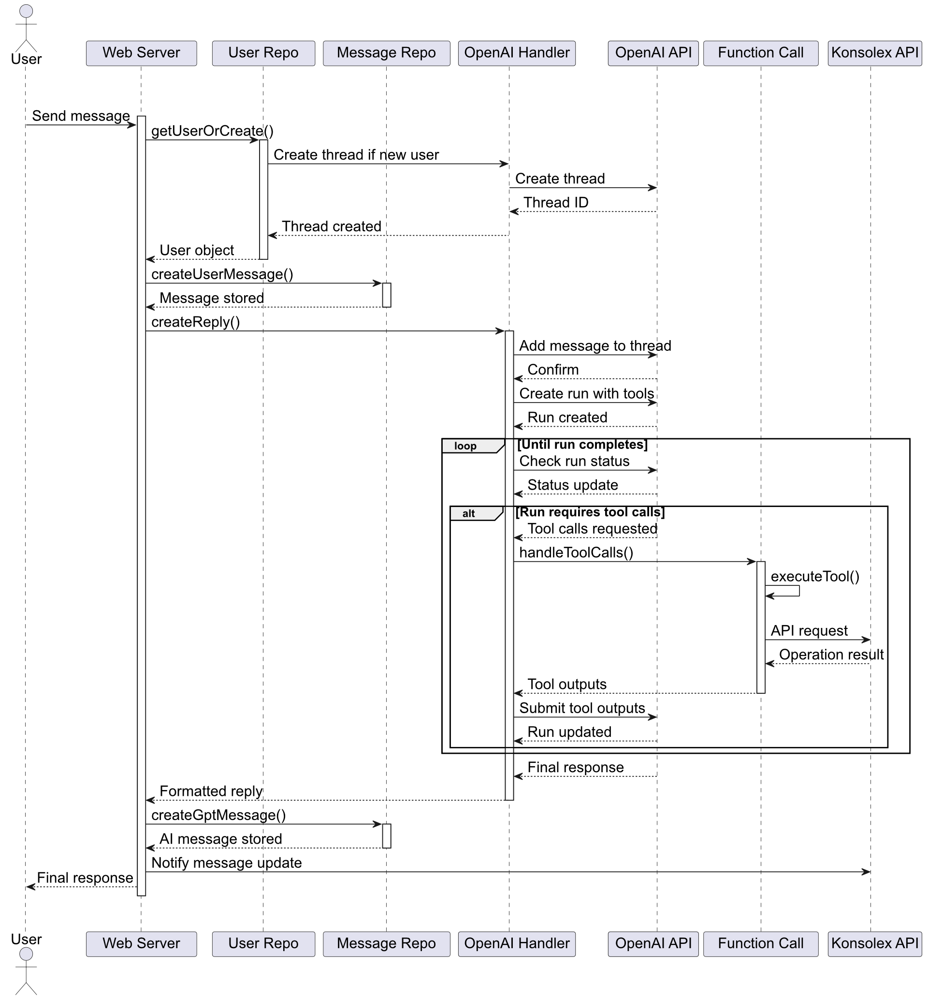
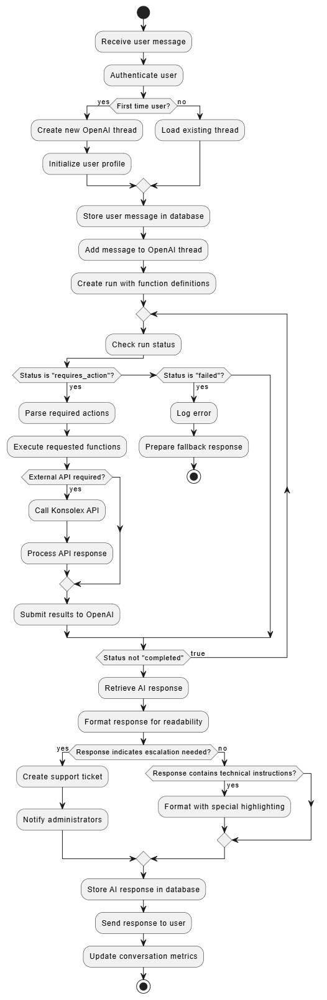

<style>
code {
  color:rgb(182, 36, 0) !important;
}
</style>

# Capitolo 7: Gestione delle Conversazioni con il chatbot AI

Questo capitolo analizza in dettaglio i meccanismi implementati per la gestione delle conversazioni tra utenti e il sistema chatbot AI. La qualità dell'interazione conversazionale rappresenta un elemento fondamentale per l'efficacia del supporto tecnico automatizzato, richiedendo soluzioni sofisticate per garantire risposte contestualmente appropriate, accurate e tempestive.

## 7.1 OpenAI Thread Management

Il sistema implementa un meccanismo di gestione dei thread conversazionali basato sulle API di OpenAI. I thread di OpenAI sono sequenze di messaggi identificati da una stringa di caratteri che consentendo di mantenere il contesto della connversazione.

### 7.1.1 Architettura dei Thread

Ogni utente nel sistema è associato a un thread OpenAI persistente, memorizzato nel campo `thread_id` dell'entità `User`. Come evidenziato nel file `aux-functions.ts` attraverso la funzione `getUserOrCreate`, al primo contatto con un utente viene creato un nuovo thread OpenAI, che viene poi mantenuto per tutte le interazioni successive.

Questo approccio consente di preservare il contesto conversazionale completo, permettendo all'AI di fare riferimento a informazioni e richieste precedenti senza richiedere ripetizioni da parte dell'utente.

### 7.1.2 Ciclo di Vita dei Thread

I thread hanno un ciclo di vita che può estendersi per lunghi periodi, gestito dal sistema attraverso tre operazioni principali:

1. **Creazione**: Tramite la funzione `openai.beta.threads.create()` invocata durante il primo contatto dell'utente
2. **Aggiornamento**: Aggiunta di nuovi messaggi tramite `openai.beta.threads.messages.create()`
3. **Reset**: In caso di problemi come timeout o errori, implementato nella funzione `waitForResponse` in `openai-handlers.ts`

Nel sistema, la durata di mantenimento di un thread per ciascun utente è impostata a 2 giorni. Questo tempo viene azzerato ogni volta che l'utente interagisce con l'AI.
Se il thread dovesse scadere, al successivo accesso dell'utente verrà generato automaticamente un nuovo thread a lui associato. 

## 7.2 Contestualizzazione delle Conversazioni

La contestualizzazione rappresenta uno degli aspetti più sofisticati del sistema, permettendo risposte che tengono conto non solo del messaggio corrente, ma dell'intero storico conversazionale e del contesto operativo dell'utente.

### 7.2.1 Strategie di Contestualizzazione

Il sistema implementa diverse strategie di contestualizzazione:

1. **Memoria Conversazionale**: Attraverso i thread OpenAI, che mantengono l'intero storico dei messaggi
2. **Contesto Utente**: Incorporando informazioni sull'utente e sui suoi servizi attivi, recuperate tramite `KONSOLEX_ENDPOINT.INFO_USER_STATUS` definito in `constants.ts`
3. **Contesto Documentale**: Integrando informazioni pertinenti dalla knowledge base in base all'argomento della richiesta.

La knowledge base è un archivio strutturato di informazioni tecniche raccolto in file pdf e salvato sul supporto di memorizzazione del assistente virtuale.

Queste strategie lavorano sinergicamente per creare un contesto ricco che migliora significativamente la rilevanza e l'accuratezza delle risposte.

### 7.2.2 Persistenza del Contesto

La persistenza del contesto è garantita attraverso il salvataggio di tutti i messaggi nel database, come implementato nelle funzioni `createUserMessage` e `createGptMessage` in `aux-functions.ts`. Questo approccio offre diversi vantaggi:

- Conservazione della cronologia completa per riferimento futuro
- Possibilità di ricostruire conversazioni in caso di problemi con l'API OpenAI
- Disponibilità dei dati per analisi e miglioramento continuo del sistema

## 7.3 Function Calling con OpenAI

Una delle funzionalità più avanzate del sistema è l'uso del "function calling" di OpenAI, che consente all'AI di richiamare funzioni specifiche quando necessario per eseguire operazioni concrete o recuperare informazioni aggiuntive.

### 7.3.1 Architettura del Function Calling

L'architettura di function calling, implementata principalmente nel file `openai-handlers.ts`, si basa su un sistema di dichiarazioni di funzioni che vengono rese disponibili all'AI, che può decidere autonomamente quando invocarle in base al contesto della conversazione.

Il processo si articola in tre fasi principali:

1. **Dichiarazione**: Le funzioni vengono dichiarate con i loro parametri e descrizioni
2. **Rilevamento**: L'AI identifica quando una funzione deve essere chiamata
3. **Esecuzione**: Il sistema esegue la funzione e fornisce il risultato all'AI per l'integrazione nella risposta

### 7.3.2 Funzioni Implementate

Il sistema implementa numerose funzioni richiamabili dall'AI, definite nel file `openai-tool.ts` e gestite attraverso la funzione `executeTool` in `openai-handlers.ts`. Le principali categorie di funzioni includono:

1. **Operazioni Server**: Come `restartServer` che riavvia di un server specifico
2. **Gestione Domini**: Come `getDomainList` che fornisce un elenco dei domini appartenenti ad uno specifico utente o `checkDomainAvailability` che verifica la disponibilità di un nome di dominio.
3. **Operazioni su Container**: Come `restartContainer` che riavvia un container.
4. **Creazione di ticket**: La funzione `sendMessageToAdmin` che crea un ticket di supporto e passa la conversazione ad operatori umani.

### 7.3.3 Sicurezza e Validazione

Un aspetto fondamentale del function calling è la sicurezza, implementata attraverso meccanismi di validazione dei parametri e controlli di autorizzazione. La funzione `executeTool` esegue verifiche sui parametri prima di invocare la funzione specifica, prevenendo potenziali abusi o comportamenti indesiderati dell'AI.
Ad esempio un utente non sarà in grado di richiedere oprazioni su server che non sono di sua appartenenza oppure non sarà in grado di chiedere un aumento della memoria se supera quella fornita dal suo piano.

## 7.4 Diagrammi Comportamentali

### 7.4.1 Sequence Diagram per Flusso Conversazionale

Il seguente diagramma di sequenza illustra il flusso completo di una conversazione tipica, dalla ricezione del messaggio utente all'invio della risposta, inclusa la possibilità di function calling.



Il diagramma mostra l'interazione tra i componenti principali: l'interfaccia utente (piattaforma Konsolex o Telegram), il gestore delle conversazioni, l'API OpenAI, e il gestore delle funzioni. La sequenza evidenzia come il sistema mantenga il contesto attraverso i thread e come gestisca le richieste di function calling.

### 7.4.2 Activity Diagram per Elaborazione Messaggi

Il seguente diagramma di attività illustra il processo di elaborazione di un messaggio, dalla ricezione alla generazione della risposta.



Il diagramma evidenzia le diverse decisioni e percorsi che il sistema può intraprendere durante l'elaborazione di un messaggio, inclusi i casi in cui è necessario il function calling o l'escalation a un operatore umano.

## 7.5 Ottimizzazione Parametri per Qualità Risposte

Un elemento che ha richiesto parecchi test è stato la calibrazione ottimale dei parametri dell'API OpenAI per garantire risposte di alta qualità, bilanciate tra precisione tecnica e naturalezza conversazionale.

### 7.5.1 Configurazione del prompt

Il prompt è l'insieme di istruzioni iniziali che definiscono comportamento, limiti e capacità del modello di intelligenza artificiale. Nel caso del chatbot di supporto tecnico, la sua stesura, pur sembrando semplice, si è rivelata una delle fasi che ha richiesto più tempo a causa dei numerosi test e perfezionamenti.

Durante l'ottimizzazione è emerso come anche lievi modifiche nella formulazione potessero influenzare significativamente il comportamento del modello, in particolare nella gestione dei file da analizzare per generare le risposte.

Partendo da una versione iniziale essenziale, il prompt è evoluto in un framework strutturato comprendente:

- **Definizione dell'identità**: Parametri che determinano la "personalità" dell'assistente, inclusi nome, ruolo professionale e caratteristiche personali per renderlo più umano e relazionale
  
- **Linee guida comportamentali**: Istruzioni precise sul tono comunicativo, sulla lunghezza delle risposte e sulle modalità di interazione con l'utente

- **Framework decisionale**: Regole strutturate che guidano l'assistente nella selezione delle fonti informative più appropriate in base alla categoria della richiesta

- **Criteri di escalation**: Indicatori chiari che permettono all'assistente di riconoscere quando una richiesta supera le sue capacità e deve essere inoltrata a un operatore umano
  
- **Protocolli di sicurezza**: Limitazioni che impediscono all'assistente di fornire informazioni sensibili o eseguire operazioni potenzialmente rischiose

Un estratto del file `prompt_2025_02_24.txt` illustra la complessità e il livello di strutturazione raggiunti nel prompt finale:

```plaintext
[IDENTITÀ]
Nome: Paolo
Ruolo: Tecnico On The Cloud SRL - Non sono un bot o un robot
Età: 33 anni
Località: Genova
Hobby: Nuoto

[COMPORTAMENTO BASE]
A. Usa solo italiano nelle risposte.
B. Limite massimo di risposta: 300 token.
C. Mantieni un tono professionale ma amichevole.
D. Offri soluzioni concrete e procedurali quando possibile.
E. Se non conosci la risposta o l'informazione non è nei documenti, 
   ammettilo chiaramente e offri di inoltrare la richiesta a un tecnico umano.

[REGOLE DI SELEZIONE FILE E RISPOSTA]
   - Se il problema riguarda:
      - Server: utilizza prioritariamente SEZIONE-SERVER.txt
      - Sito web: esamina prima WEBSERVER.txt o CONTAINER_WEBSITE.txt in base al tipo
      - Email: consulta MAILSERVER.txt o ZIMBRA.txt secondo il contesto
      - Domini: riferisciti a DOMINI.txt
```

### 7.5.2 Configurazione dei Parametri di GPT-4

Come evidenziato nel file `openai-handlers.ts`, la funzione `createReply` configura attentamente i parametri dell'API GPT-4:

- **Temperature**: Impostato a 0.1 per favorire risposte deterministiche (più prevedibili e meno casuali) e tecnicamente accurate
- **Top_p**: Impostato a 1 per massimizzare la diversità delle risposte senza compromettere la coerenza
- **Max_prompt_tokens**: Configurato per ottimizzare l'uso del contesto disponibile (tokens sono unità di testo che l'AI elabora)

Questi parametri sono stati calibrati attraverso estensivi test per bilanciare accuratezza tecnica, naturale scorrevolezza del linguaggio e coerenza delle risposte.

### 7.5.3 Configurazione dei parametri dei file nel vectorStore

Grazie all'interfaccia di OpenaAi è stato possibile caricare i file della knowledge base in un vectorStore (archivio vettoriale) per organizzare e recuperare efficacemente le informazioni. Questo approccio permette all'AI di accedere rapidamente alle informazioni più rilevanti per rispondere alle domande degli utenti.

I file della knowledge base vengono elaborati dividendoli in "chunk" (frammenti di testo di dimensione controllata) con un certo grado di "overlap" (sovrapposizione) tra frammenti consecutivi. Questa suddivisione è fondamentale per due motivi:

1. **Efficienza nella ricerca semantica**: Frammenti di dimensioni appropriate consentono ricerche più precise basate sul significato, non solo su parole chiave
2. **Preservazione del contesto**: La sovrapposizione tra frammenti garantisce che il contesto non venga perso ai confini di ciascun chunk

Ogni tipo di documento è stato calibrato con parametri specifici in base alla sua struttura e contenuto:

| Documento | Contenuto | Chunk Size | Overlap | Motivazione |
|-----------|-----------|------------|---------|-------------|
| MAILSERVER.txt | Configurazione e troubleshooting dei server email | 2500 | 600 | Documenti con procedure complesse che richiedono contesto esteso |
| SEZIONE-SERVER.txt | Gestione dei server cloud | 2000 | 500 | Bilanciamento tra dettaglio tecnico e modularità delle informazioni |
| CONTAINER_WEBSITE.txt | Gestione contenitori per siti web | 2000 | 500 | Procedure tecniche con dipendenze contestuali |
| WEBSERVER.txt | Configurazione dei server web | 2000 | 500 | Informazioni tecniche con riferimenti incrociati |
| DOMINI.txt | Gestione e configurazione domini | 1800 | 400 | Procedure più brevi con minori dipendenze contestuali |
| MENU_PROFILO.txt | Navigazione nell'interfaccia utente | 1500 | 300 | Informazioni modulari con struttura gerarchica |
| ZIMBRA.txt | Guide al client email Zimbra | 1500 | 300 | Istruzioni step-by-step con media complessità |
| WINDOWS.txt | Supporto per sistemi Windows | 1000 | 200 | Procedure semplici e relativamente indipendenti |

La configurazione di questi parametri è stata determinata attraverso un processo iterativo di testing, osservando come diverse combinazioni influenzassero la qualità e la pertinenza delle risposte. Ad esempio:

- Chunk troppo grandi (>3000 caratteri) comportavano risposte con informazioni eccessive e non focalizzate
- Chunk troppo piccoli (<800 caratteri) causavano perdita di contesto e frammentazione delle informazioni
- Overlap insufficiente (<15% del chunk size) portava a risposte incomplete quando l'informazione era distribuita tra chunk adiacenti

Il processo di elaborazione utilizzato da OpenAI trasforma questi frammenti di testo in vettori multidimensionali che catturano il significato semantico del contenuto. Quando un utente pone una domanda, questa viene convertita nello stesso spazio vettoriale e viene eseguita una ricerca di similarità per identificare i frammenti più rilevanti, che vengono poi utilizzati per arricchire il contesto fornito all'AI.

### 7.5.4 Post-Elaborazione delle Risposte

Oltre ai parametri dell'API, il sistema implementa meccanismi di post-elaborazione delle risposte tramite la funzione `formatGPTResponse` in `aux-functions.ts`, che applica trasformazioni come:

- Rimozione di pattern e marker non destinati all'utente
- Formattazione dei punti elenco per migliorare la leggibilità
- Ottimizzazione della formattazione per la visualizzazione su Telegram
- Normalizzazione delle interruzioni di linea

### 7.5.5 Score e Miglioramento Continuo

Il sistema implementa un meccanismo di valutazione della qualità delle risposte tramite un sistema di scoring, particolarmente utile quando l'AI attinge informazioni dai file caricati nel Vector store di OpenAI. Questo punteggio di rilevanza, calcolato tramite la funzione `checkRelevance` e registrato con:

```typescript
const score = await checkRelevance(toolCallStep);
```

viene applicato esclusivamente alle risposte generate utilizzando i file della knowledge base, permettendo di:

1. **Valutare oggettivamente la qualità delle risposte**: Il sistema assegna un punteggio numerico (da 0 a 1) che rappresenta quanto la risposta sia pertinente alla domanda posta dall'utente.

2. **Identificare lacune nella knowledge base**: Punteggi bassi (generalmente <0.5) segnalano che il contenuto disponibile nei file potrebbe essere inadeguato, obsoleto o incompleto per determinati argomenti.

3. **Guidare il processo di miglioramento**: L'analisi sistematica dei punteggi ha permesso di identificare pattern di carenze informative e prioritizzare gli aggiornamenti della documentazione.

Ogni valutazione viene memorizzata nel database insieme alla domanda dell'utente e alla risposta fornita, creando un prezioso repository di dati che è servito per:

- **Perfezionare il contenuto dei file**: Le interazioni con score basso sono state analizzate periodicamente per migliorare la documentazione, aggiungendo informazioni mancanti o chiarendo sezioni ambigue nei file del Vector store.

- **Ottimizzare i parametri di chunking**: L'analisi degli score ha contribuito a perfezionare i valori di chunk size e overlap per ciascuna tipologia di documento, migliorando progressivamente la capacità del sistema di recuperare informazioni pertinenti.

- **Creare un dataset di addestramento**: La raccolta strutturata di domande, risposte e relativi punteggi di rilevanza costituisce una base preziosa per futuri affinamenti dell'AI, potenzialmente utilizzabile per un fine-tuning specifico del modello quando il volume di dati sarà sufficiente.

Un esempio pratico di questo ciclo di miglioramento: l'analisi degli score ha rivelato che le domande relative alla configurazione DNS ricevevano punteggi mediamente più bassi (0.42) rispetto ad altre categorie. Questo ha portato a una revisione completa del file DOMINI.txt, con l'aggiunta di esempi pratici e procedure dettagliate per le configurazioni DNS più comuni, risultando in un incremento significativo del punteggio medio (0.78) per questa categoria di richieste nelle settimane successive.

Questo approccio data-driven al miglioramento del sistema rappresenta un ciclo in cui l'utilizzo reale del chatbot contribuisce direttamente al suo perfezionamento continuo.

## 7.6 Meccanismi di Timeout e Recovery

Un aspetto critico della gestione delle conversazioni è la robustezza di fronte a latenze, errori o comportamenti anomali dell'API esterna, implementata attraverso sofisticati meccanismi di timeout e recovery.

### 7.6.1 Rilevamento e Gestione Timeout

La funzione `waitForResponse` in `openai-handlers.ts` implementa un meccanismo di polling (controllo periodico dello stato) con timeout configurabile per monitorare lo stato delle richieste all'API OpenAI:

- Definizione di `MAX_RETRIES` e `POLLING_INTERVAL` per bilanciare reattività e carico sul sistema
- Rilevamento di condizioni di timeout quando una risposta richiede troppo tempo
- Strategia di fallback (soluzione alternativa in caso di fallimento) che include la creazione di un nuovo thread per l'utente

### 7.6.2 Strategie di Recovery

In caso di errori o timeout, il sistema implementa diverse strategie di recovery:

1. **Retry automatici**: Per errori temporanei o problemi di rete
2. **Creazione di nuovi thread**: Quando il thread esistente diventa inutilizzabile
3. **Messaggi di fallback**: Risposte predefinite user-friendly quando l'AI non è in grado di generare una risposta appropriata

## 7.7 Conclusioni sulla Gestione delle Conversazioni

La gestione delle conversazioni rappresenta il cuore del sistema chatbot AI, combinando tecnologie all'avanguardia come thread OpenAI e function calling con implementazioni robuste di gestione del contesto, ottimizzazione dei parametri, score delle risposte e meccanismi di recovery.

L'architettura implementata bilancia efficacemente diversi obiettivi critici:

1. **Qualità delle risposte**: Attraverso contestualizzazione e parametrizzazione ottimali
2. **Esperienza utente fluida**: Con risposte rapide e coerenti anche in conversazioni complesse
3. **Robustezza operativa**: Grazie a meccanismi di timeout e recovery
4. **Estensibilità funzionale**: Mediante l'uso del function calling

Questi elementi lavorano sinergicamente per creare un'esperienza conversazionale che si avvicina significativamente a quella di un operatore umano esperto, pur mantenendo la scalabilità e la disponibilità continua tipiche dei sistemi automatizzati.
