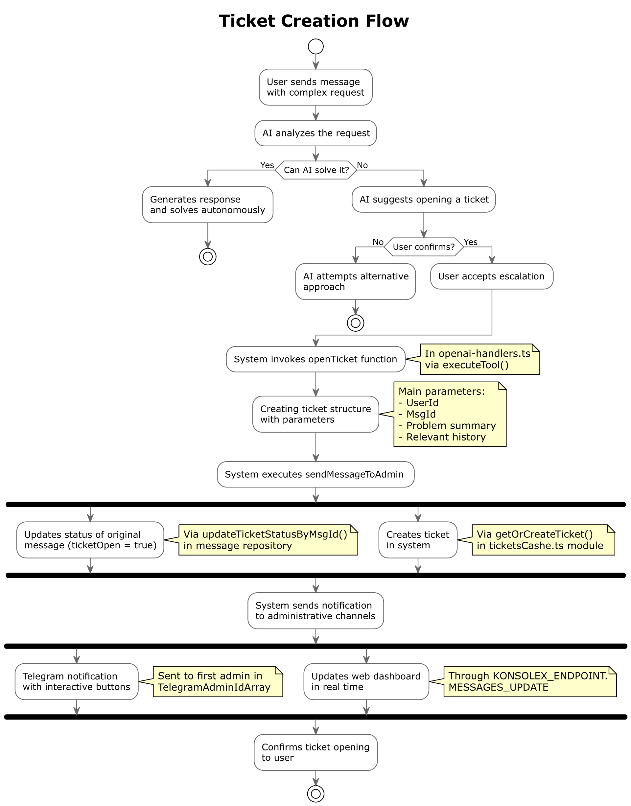
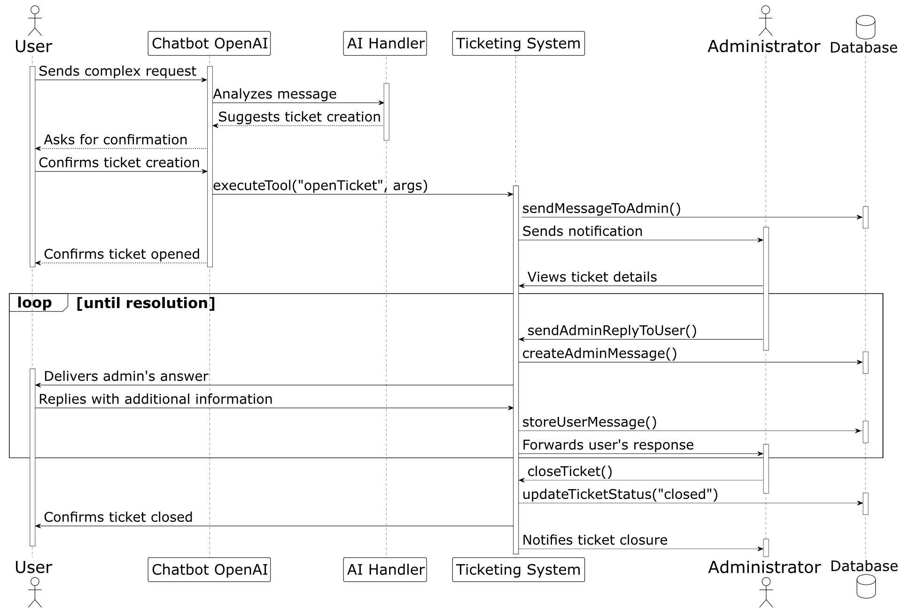

# Capitolo 9: Sistema di Ticketing

Il sistema di ticketing costituisce un elemento necessario nell'architettura del chatbot, operando come meccanismo di transizione intelligente tra la risposta automatizzata dell'AI e l'intervento specialistico degli operatori umani. Questo capitolo esplora in profondità l'implementazione del sistema, illustrando come realizzi la continuità dell'assistenza quando le richieste superano le capacità dell'automazione, garantendo che ogni problema trovi la giusta modalità di risoluzione.

## 9.1 Rilevamento di Problematiche Non Risolvibili dall'AI

Il sistema implementa un meccanismo strutturato per identificare situazioni in cui l'intervento umano diventa necessario, basato su parametri oggettivi di qualità della risposta piuttosto che su pattern predefiniti.

### 9.1.1 Valutazione della Qualità delle Risposte

Quando un utente pone una domanda, il sistema OpenAI ricerca automaticamente informazioni pertinenti nei file caricati nel vectorStore. Durante questo processo:

1. La query dell'utente viene trasformata in un vettore semantico
2. Il sistema cerca nei documenti disponibili per trovare le sezioni più rilevanti
3. Viene calcolato un punteggio di rilevanza per la risposta generata

Quando il punteggio di rilevanza non raggiunge una soglia minima (0.4), il sistema determina autonomamente che non dispone di informazioni sufficienti per fornire una risposta accurata. In questi casi, invece di presentare informazioni potenzialmente errate, il chatbot:

- Informa esplicitamente l'utente dell'impossibilità di fornire una risposta adeguata
- Suggerisce il passaggio a un operatore umano come soluzione alternativa
- Richiede conferma esplicita prima di procedere all'escalation

Questo approccio basato su metriche quantitative riduce significativamente i falsi positivi e garantisce che solo le questioni realmente al di fuori delle capacità dell'AI vengano escalate.

### 9.1.2 Processo di Escalation

L'escalation verso operatori umani può avvenire attraverso due modalità principali:

1. **Escalation Automatica**: Quando il sistema rileva autonomamente un basso punteggio di confidenza nella risposta
2. **Escalation Esplicita**: Quando l'utente richiede direttamente il supporto umano

In entrambi i casi, la funzione `openTicket` definita in `openai-tool.ts` viene invocata solo dopo conferma esplicita dell'utente, come specificato nella descrizione della funzione: "apri solo con risposta affermativa dell'utente". Questo requisito di conferma garantisce che il passaggio all'operatore umano avvenga esclusivamente quando desiderato dall'utente.

Una volta ottenuta la conferma, la funzione `openTicket` raccoglie tutti i dati pertinenti della conversazione, inclusi i tentativi precedenti di risposta, per fornire all'operatore umano il contesto completo necessario per una risoluzione efficace.

## 9.2 Creazione e Routing dei Ticket

Una volta identificata la necessità di intervento umano, il sistema implementa un processo strutturato di creazione e routing dei ticket, garantendo la corretta registrazione del problema e la sua assegnazione agli operatori appropriati.

### 9.2.1 Struttura e Creazione del Ticket

I ticket sono implementati come entità temporanee mantenute in memoria, con una relazione diretta ai messaggi della conversazione salvati nel database. In `endpoint.ts`, la funzione `sendMessageToAdmin` è responsabile della creazione del ticket e della sua strutturazione:

1. Estrae il contesto utente e il contenuto della richiesta
2. Genera un messaggio strutturato che include identificativo utente e descrizione problema
3. Aggiorna i parametri del messaggio originale impostando `ticketOpen = true` e assegnando un `ticket_id`
4. Crea il ticket in cache attraverso `getOrCreateTicket`

Il sistema è progettato per consentire a ciascun utente di avere al massimo un ticket aperto alla volta, semplificando la gestione e prevenendo duplicazioni di richieste di supporto.

### 9.2.2 Meccanismo di Caching per Performance

Il sistema implementa un meccanismo di caching attraverso il modulo `ticketsCashe.ts` che gestisce i ticket esclusivamente in memoria per garantire prestazioni ottimali:

1. Mantiene in memoria i ticket attivi per risposte rapide
2. Utilizza il database solo per memorizzare i messaggi associati al ticket, non il ticket stesso
3. Fornisce funzioni specifiche come `findTicket`, `getAllOpenTickets` e `closeTicket` che operano sulla cache

Questa architettura crea una separazione netta tra:
- Ticket (entità temporanee in memoria)
- Messaggi (entità persistenti nel database con attributi `ticketOpen` e `ticket_id` che li collegano ai ticket)

Questo approccio riduce significativamente il carico sul database durante le operazioni di gestione dei ticket, mantenendo al contempo la persistenza delle conversazioni.

### 9.2.3 Routing verso gli Amministratori

Il sistema implementa un instradamento dei ticket verso gli amministratori attraverso molteplici canali:

1. **Notifiche Telegram**: La funzione `sendMessageToAdmin` in `endpoint.ts` invia notifiche immediate agli amministratori attraverso Telegram, con bottoni interattivi per azioni rapide.

2. **Dashboard Web Konsolex**: I ticket vengono resi disponibili attraverso l'API REST definita in `web-server.ts`, con endpoint come `ADMIN_API.ADMIN_TICKET_LIST` che forniscono accesso strutturato all'interfaccia amministrativa.

Questo approccio multi-canale garantisce che gli amministratori vengano prontamente informati dei nuovi ticket, indipendentemente dal dispositivo o dall'interfaccia che stanno utilizzando.

## 9.3 Interfaccia Amministrativa

L'interfaccia amministrativa rappresenta il punto di contatto principale tra gli operatori umani e il sistema di ticketing, offrendo strumenti completi per la gestione efficiente delle richieste di supporto.

### 9.3.1 Interfaccia Telegram

Per gli amministratori, il bot Telegram offre un'interfaccia immediata e mobile-friendly per la gestione dei ticket, implementata in diverse parti del codice:

1. **Notifiche Strutturate**: In `endpoint.ts`, la funzione `sendMessageToAdmin` costruisce messaggi informativi con dettagli dell'utente e della richiesta.

2. **Bottoni Interattivi**: Le notifiche includono bottoni definiti nella variabile `inlineKeyboard` per azioni rapide come:
   - Risposta al ticket (`ReplyToTicket`)
   - Chiusura del ticket (`CloseTicket`)
   - Visualizzazione dei messaggi utente (`ShowUserMessages`)

3. **Flusso di Risposta**: Il sistema facilita un flusso di risposta naturale, con gli operatori che possono rispondere direttamente dal client Telegram.

### 9.3.2 Dashboard Web Konsolex

Complementare all'interfaccia Telegram, il sistema implementa una dashboard web sulla piattaforma propitaria Konsolex, accessibile tramite le API REST definite in `web-server.ts`:

1. **Lista Ticket**: L'endpoint `ADMIN_API.ADMIN_TICKET_LIST` fornisce un elenco completo dei ticket aperti, ordinati per priorità e data.

2. **Visualizzazione Dettagli**: Gli admin possono accedere al contesto completo della conversazione tramite l'endpoint `ADMIN_API.GET_REPLAY_ADMIN_USER`.

3. **Gestione Ticket**: Gli endpoint `ADMIN_API.ADMIN_REPLY_TICKET` e `ADMIN_API.CLOSE_TICKET` implementano le azioni principali di gestione.

La dashboard web è progettata per sessioni più estese di gestione ticket, offrendo visualizzazioni dettagliate e strumenti avanzati che complementano le funzionalità più immediate dell'interfaccia Telegram.

### 9.3.3 Visualizzazione del Contesto

Un elemento distintivo dell'interfaccia amministrativa è la capacità di presentare il contesto completo della conversazione, cruciale per una risposta efficace. Implementato in `web-server.ts` attraverso l'endpoint `API.GET_TICKETS_MESSAGES_USER`, il sistema:

1. Recupera tutti i messaggi relativi al ticket, inclusi i messaggi utente, le risposte AI e gli eventuali tentativi precedenti di risoluzione
2. Organizza cronologicamente la conversazione
3. Evidenzia passaggi critici come operazioni tecniche tentate o fallite

Questa visione completa del contesto riduce significativamente il tempo necessario per comprendere la problematica e fornire una risposta appropriata.

## 9.4 Diagrammi dei Processi

### 9.4.1 Activity Diagram creazione del Ticket

Il seguente diagramma di attività illustra il processo decisionale che porta alla creazione di un ticket, evidenziando i punti di valutazione cruciali nel flusso.

Il flusso inizia con una richiesta complessa dell'utente che viene analizzata dall'AI. Se l'AI può risolvere autonomamente il problema, il processo termina con una risposta diretta. In caso contrario, il sistema valuta se si tratta di una richiesta esplicita di supporto umano o se l'AI stessa rileva la necessità di escalation. In quest'ultimo caso, viene richiesta la conferma dell'utente prima di procedere.

Una volta approvata la creazione del ticket, il sistema invoca la funzione `openTicket` che avvia tre processi paralleli:
- Aggiornamento dello stato del messaggio originale
- Creazione del ticket nel sistema di caching
- Preparazione dei bottoni interattivi per gli amministratori

Infine, le notifiche vengono inviate simultaneamente ai canali Telegram e alla dashboard web, completando il processo di creazione del ticket.

### 9.4.2 Sequence Diagram per Gestione Ticket tra AI e Operatori

Il seguente diagramma di sequenza mostra l'interazione temporale tra i vari componenti del sistema durante l'intero ciclo di vita di un ticket.

Il diagramma è organizzato in tre fasi principali:

1. **Rilevamento e Creazione**: Mostra come l'utente inizia l'interazione, come l'AI analizza il messaggio e suggerisce la creazione di un ticket, e come, dopo la conferma dell'utente, il sistema crea il ticket e notifica l'amministratore.

2. **Gestione e Risposta**: Illustra il ciclo di comunicazione continuativa tra utente e amministratore, dove l'amministratore può rispondere attraverso diverse interfacce (Telegram o dashboard web). Questa fase continua in un loop finché il problema non viene risolto.

3. **Risoluzione e Chiusura**: Rappresenta le modalità con cui un ticket può essere chiuso per azione diretta dell'amministratore, concludendo con l'aggiornamento dello stato e la notifica di chiusura.

Il diagramma evidenzia chiaramente come il Chatbot OpenAI sia coinvolto solo nella fase iniziale, mentre la comunicazione successiva avviene direttamente tra utente, sistema di ticketing e amministratore.

## 9.5 Meccanismi di Chiusura

Il sistema implementa approcci strutturati per la chiusura dei ticket e la raccolta di feedback, fondamentali per il miglioramento continuo del servizio.

La chiusura dei ticket è gestita attraverso funzionalità implementate in `web-server.ts` e nel modulo `ticketsCashe.ts`:

1. **Chiusura da Interfaccia Admin**: Gli amministratori possono chiudere esplicitamente un ticket attraverso:
   - L'endpoint `ADMIN_API.CLOSE_TICKET` nella dashboard web
   - Il bottone di callback `CallbackQuery.closeTicket` nell'interfaccia Telegram

2. **Risoluzione Implicita**: Il sistema supporta anche la chiusura implicita quando:
   - Il problema è stato risolto come confermato dall'utente
   - Non ci sono state interazioni per un periodo prolungato dopo una risposta risolutiva

3. **Aggiornamento Stati**: La funzione `closeTicket` in `ticketsCashe.ts` si occupa di:
   - Aggiornare lo stato del ticket a "chiuso"
   - Registrare il timestamp di chiusura
   - Notificare tutte le parti coinvolte

## 9.6 Conclusioni sul Sistema di Ticketing

Il sistema di ticketing rappresenta un elemento fondamentale dell'architettura complessiva, fungendo da ponte essenziale tra l'automazione dell'AI e la competenza umana. La sua implementazione riflette un approccio equilibrato che:

1. Massimizza l'efficienza attraverso l'automazione delle richieste standard
2. Garantisce qualità e precisione nelle risposte a problematiche complesse tramite l'intervento umano
3. Fornisce un'esperienza utente coerente e fluida attraverso l'intera catena di supporto

La stretta integrazione tra il sistema di ticketing e gli altri componenti dell'architettura crea un continuum di supporto che si adatta dinamicamente alla complessità delle richieste, offrendo il livello appropriato di assistenza per ogni scenario.

