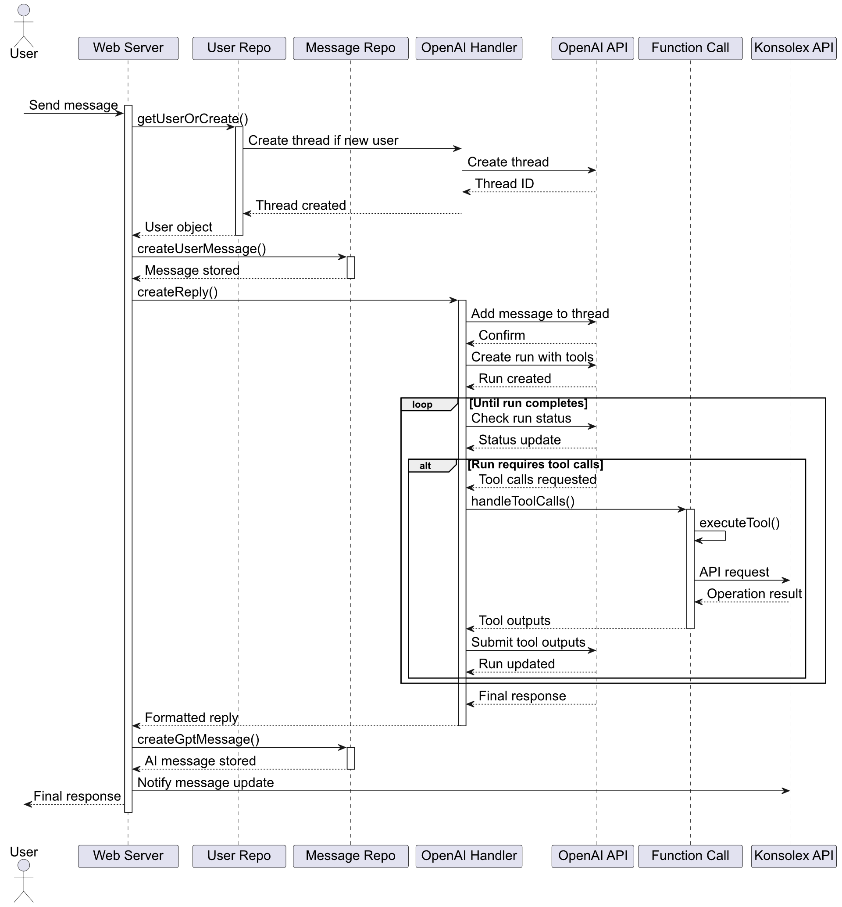

# Capitolo 9: Gestione delle Conversazioni

Questo capitolo analizza in dettaglio i meccanismi implementati per la gestione delle conversazioni tra utenti e il sistema chatbot AI. La qualità dell'interazione conversazionale rappresenta un elemento fondamentale per l'efficacia del supporto tecnico automatizzato, richiedendo soluzioni sofisticate per garantire risposte contestualmente appropriate, accurate e tempestive.

## 9.1 OpenAI Thread Management

Il sistema implementa un sofisticato meccanismo di gestione dei thread conversazionali basato sulle API di OpenAI, consentendo di mantenere il contesto attraverso molteplici interazioni e fornire risposte coerenti nel tempo.

### 9.1.1 Architettura dei Thread

Ogni utente nel sistema è associato a un thread OpenAI persistente, memorizzato nel campo `thread_id` dell'entità `User`. Come evidenziato nel file `aux-functions.ts` attraverso la funzione `getUserOrCreate`, al primo contatto con un utente viene creato un nuovo thread OpenAI, che viene poi mantenuto per tutte le interazioni successive.

Questo approccio consente di preservare il contesto conversazionale completo, permettendo all'AI di fare riferimento a informazioni e richieste precedenti senza richiedere ripetizioni da parte dell'utente.

### 9.1.2 Ciclo di Vita dei Thread

I thread hanno un ciclo di vita che può estendersi per lunghi periodi, gestito dal sistema attraverso tre operazioni principali:

1. **Creazione**: Tramite la funzione `openai.beta.threads.create()` invocata durante il primo contatto dell'utente
2. **Aggiornamento**: Aggiunta di nuovi messaggi tramite `openai.beta.threads.messages.create()`
3. **Reset**: In caso di problemi come timeout o errori, implementato nella funzione `waitForResponse` in `openai-handlers.ts`

La gestione dell'obsolescenza dei thread viene affrontata attraverso meccanismi di reset automatico quando il contesto diventa troppo ampio o quando si verificano errori persistenti.

### 9.1.3 Sincronizzazione Multi-canale

Un aspetto innovativo dell'implementazione è la sincronizzazione dei thread tra diversi canali di comunicazione (Telegram e interfaccia web). Questo è realizzato attraverso l'identificazione univoca degli utenti tramite la funzione `setTelegramId` in `endpoint.ts`, che collega gli account Telegram agli utenti della piattaforma Konsolex.

## 9.2 Contestualizzazione delle Conversazioni

La contestualizzazione rappresenta uno degli aspetti più sofisticati del sistema, permettendo risposte che tengono conto non solo del messaggio corrente, ma dell'intero storico conversazionale e del contesto operativo dell'utente.

### 9.2.1 Strategie di Contestualizzazione

Il sistema implementa diverse strategie di contestualizzazione:

1. **Memoria Conversazionale**: Attraverso i thread OpenAI, che mantengono l'intero storico dei messaggi
2. **Contesto Utente**: Incorporando informazioni sull'utente e sui suoi servizi attivi, recuperate tramite `KONSOLEX_ENDPOINT.INFO_USER_STATUS` definito in `constants.ts`
3. **Contesto Documentale**: Integrando informazioni pertinenti dalla knowledge base in base all'argomento della richiesta

Queste strategie lavorano sinergicamente per creare un contesto ricco che migliora significativamente la rilevanza e l'accuratezza delle risposte.

### 9.2.2 Persistenza del Contesto

La persistenza del contesto è garantita attraverso il salvataggio di tutti i messaggi nel database, come implementato nelle funzioni `createUserMessage` e `createGptMessage` in `aux-functions.ts`. Questo approccio offre diversi vantaggi:

- Conservazione della cronologia completa per riferimento futuro
- Possibilità di ricostruire conversazioni in caso di problemi con l'API OpenAI
- Disponibilità dei dati per analisi e miglioramento continuo del sistema

### 9.2.3 Gestione delle Interruzioni

Un aspetto critico nella gestione delle conversazioni è il trattamento appropriato delle interruzioni temporali tra messaggi. Il sistema implementa meccanismi per rilevare il contesto rilevante anche in conversazioni che si svolgono a distanza di giorni, mantenendo la coerenza nelle risposte.

## 9.3 Function Calling con OpenAI

Una delle funzionalità più avanzate del sistema è l'uso del "function calling" di OpenAI, che consente all'AI di richiamare funzioni specifiche quando necessario per eseguire operazioni concrete o recuperare informazioni aggiuntive.

### 9.3.1 Architettura del Function Calling

L'architettura di function calling, implementata principalmente nel file `openai-handlers.ts`, si basa su un sistema di dichiarazioni di funzioni che vengono rese disponibili all'AI, che può decidere autonomamente quando invocarle in base al contesto della conversazione.

Il processo si articola in tre fasi principali:

1. **Dichiarazione**: Le funzioni vengono dichiarate con i loro parametri e descrizioni
2. **Rilevamento**: L'AI identifica quando una funzione deve essere chiamata
3. **Esecuzione**: Il sistema esegue la funzione e fornisce il risultato all'AI per l'integrazione nella risposta

### 9.3.2 Funzioni Implementate

Il sistema implementa numerose funzioni richiamabili dall'AI, definite nel file `openai-tool.ts` e gestite attraverso la funzione `executeTool` in `openai-handlers.ts`. Le principali categorie di funzioni includono:

1. **Operazioni Server**: Come `restartServer` e `restartMysqlOrPostfix`
2. **Gestione Domini**: Come `getDomainList` e `checkDomainAvailability`
3. **Operazioni su Container**: Come `restartContainer`
4. **Escalation**: La funzione `sendMessageToAdmin` per l'escalation a operatori umani

### 9.3.3 Sicurezza e Validazione

Un aspetto fondamentale del function calling è la sicurezza, implementata attraverso meccanismi di validazione dei parametri e controlli di autorizzazione. La funzione `executeTool` esegue verifiche sui parametri prima di invocare la funzione specifica, prevenendo potenziali abusi o comportamenti indesiderati dell'AI.

## 9.4 Diagrammi Comportamentali

### 9.4.1 Sequence Diagram per Flusso Conversazionale

Il seguente diagramma di sequenza illustra il flusso completo di una conversazione tipica, dalla ricezione del messaggio utente all'invio della risposta, inclusa la possibilità di function calling.

Il diagramma mostra l'interazione tra i componenti principali: l'interfaccia utente (Telegram), il gestore delle conversazioni, l'API OpenAI, e il gestore delle funzioni. La sequenza evidenzia come il sistema mantenga il contesto attraverso i thread e come gestisca le richieste di function calling.

### 9.4.2 Activity Diagram per Elaborazione Messaggi

Il seguente diagramma di attività illustra il processo di elaborazione di un messaggio, dalla ricezione alla generazione della risposta.

Il diagramma evidenzia le diverse decisioni e percorsi che il sistema può intraprendere durante l'elaborazione di un messaggio, inclusi i casi in cui è necessario il function calling o l'escalation a un operatore umano.

### 9.4.3 State Diagram per Ciclo di Vita della Conversazione

Il seguente diagramma di stato illustra il ciclo di vita completo di una conversazione nel sistema.

Il diagramma mostra i diversi stati che una conversazione può attraversare, dalle fasi iniziali alla potenziale escalation e alla risoluzione, evidenziando le transizioni tra gli stati e gli eventi che le innescano.

## 9.5 Ottimizzazione Parametri per Qualità Risposte

Un elemento cruciale per l'efficacia del sistema è la calibrazione ottimale dei parametri dell'API OpenAI per garantire risposte di alta qualità, bilanciate tra precisione tecnica e naturalezza conversazionale.

### 9.5.1 Configurazione dei Parametri

Come evidenziato nel file `openai-handlers.ts`, la funzione `createReply` configura attentamente i parametri dell'API GPT-4:

- **Temperature**: Impostato a 0.1 per favorire risposte deterministiche e tecnicamente accurate
- **Top_p**: Impostato a 1 per massimizzare la diversità delle risposte senza compromettere la coerenza
- **Max_prompt_tokens**: Configurato per ottimizzare l'uso del contesto disponibile

Questi parametri sono stati calibrati attraverso estensivi test per bilanciare accuratezza tecnica, naturale scorrevolezza del linguaggio e coerenza delle risposte.

### 9.5.2 Post-Elaborazione delle Risposte

Oltre ai parametri dell'API, il sistema implementa meccanismi di post-elaborazione delle risposte tramite la funzione `formatGPTResponse` in `aux-functions.ts`, che applica trasformazioni come:

- Rimozione di pattern e marker non destinati all'utente
- Formattazione dei punti elenco per migliorare la leggibilità
- Ottimizzazione della formattazione per la visualizzazione su Telegram
- Normalizzazione delle interruzioni di linea

### 9.5.3 Feedback e Miglioramento Continuo

Il sistema implementa meccanismi per raccogliere feedback impliciti ed espliciti sulla qualità delle risposte, utilizzati per ottimizzare continuamente i parametri e le strategie di risposta:

- Monitoraggio della frequenza di escalation dopo le risposte AI
- Analisi dei pattern di richieste ripetute che indicano incomprensioni
- Registrazione di metriche di qualità nel repository degli score

## 9.6 Meccanismi di Timeout e Recovery

Un aspetto critico della gestione delle conversazioni è la robustezza di fronte a latenze, errori o comportamenti anomali dell'API esterna, implementata attraverso sofisticati meccanismi di timeout e recovery.

### 9.6.1 Rilevamento e Gestione Timeout

La funzione `waitForResponse` in `openai-handlers.ts` implementa un meccanismo di polling con timeout configurabile per monitorare lo stato delle richieste all'API OpenAI:

- Definizione di `MAX_RETRIES` e `POLLING_INTERVAL` per bilanciare reattività e carico sul sistema
- Rilevamento di condizioni di timeout quando una risposta richiede troppo tempo
- Strategia di fallback che include la creazione di un nuovo thread per l'utente

### 9.6.2 Strategie di Recovery

In caso di errori o timeout, il sistema implementa diverse strategie di recovery:

1. **Retry automatici**: Per errori temporanei o problemi di rete
2. **Creazione di nuovi thread**: Quando il thread esistente diventa inutilizzabile
3. **Messaggi di fallback**: Risposte predefinite user-friendly quando l'AI non è in grado di generare una risposta appropriata

### 9.6.3 Resilienza a Interruzioni API

Il sistema è progettato per essere resiliente a interruzioni temporanee dell'API OpenAI, implementando meccanismi per:

- Bufferizzare le richieste durante interruzioni brevi
- Fornire risposte degradate ma funzionali durante problemi prolungati
- Riprendere il normale funzionamento quando l'API torna disponibile

## 9.7 Conclusioni sulla Gestione delle Conversazioni

La gestione delle conversazioni rappresenta il cuore del sistema chatbot AI, combinando tecnologie all'avanguardia come thread OpenAI e function calling con implementazioni robuste di gestione del contesto, ottimizzazione dei parametri e meccanismi di recovery.

L'architettura implementata bilancia efficacemente diversi obiettivi critici:

1. **Qualità delle risposte**: Attraverso contestualizzazione e parametrizzazione ottimali
2. **Esperienza utente fluida**: Con risposte rapide e coerenti anche in conversazioni complesse
3. **Robustezza operativa**: Grazie a meccanismi di timeout e recovery
4. **Estensibilità funzionale**: Mediante il paradigma del function calling

Questi elementi lavorano sinergicamente per creare un'esperienza conversazionale che si avvicina significativamente a quella di un operatore umano esperto, pur mantenendo la scalabilità e la disponibilità continua tipiche dei sistemi automatizzati.
