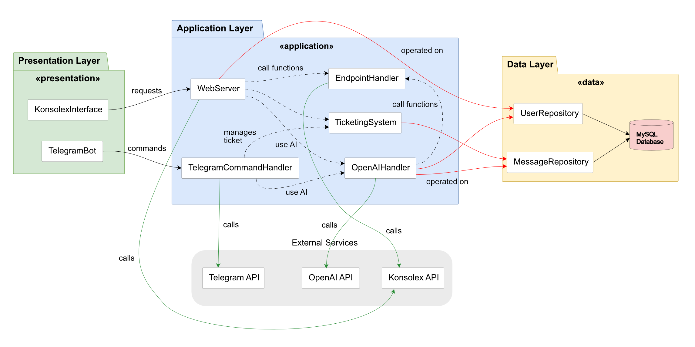
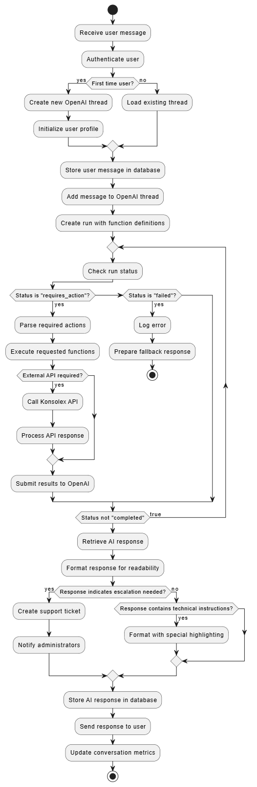

<style>
code {
  color:rgb(182, 36, 0) !important;
}
</style>

# Implementazione di un Assistente AI per il Supporto Tecnico Konsolex

## Università degli Studi di Genova
### Corso di Laurea Informatica ordinamento tecnologico

---

**Tesi di Laurea**

**Candidato:**  
Sebastiano Gastaldi


**Relatore**  
Professor Stefano Rovetta

**Anno Accademico:**  
2024/2025

---

## Codice Sorgente del Progetto

Il codice sorgente completo del progetto, insieme ai file citati nella tesi, è disponibile nel repository GitHub:  
[https://github.com/Gaseb86/tirocinio.git](https://github.com/Gaseb86/tirocinio.git)

---

## Indice

### Capitolo 1: Introduzione e Contesto
- 1.1 Abstract del Progetto
- 1.2 Contesto Aziendale: OnTheCloud e Konsolex
- 1.3 Sfide del Supporto Tecnico nel Cloud B2B
- 1.4 Vantaggi dell'Automazione tramite AI
- 1.5 Obiettivi del Progetto

### Capitolo 2: Requisiti di Sistema
- 2.1 Requisiti Funzionali
  - 2.1.1 Gestione Automatica delle Richieste di Supporto Tecnico
  - 2.1.2 Interfaccia Conversazionale Multicanale
  - 2.1.3 Sistema di Knowledge Base per Risposte Tecniche
  - 2.1.4 Meccanismo di Escalation verso Operatori Umani attraverso sistema di ticket
  - 2.1.5 Operazioni Tecniche Eseguibili tramite AI
- 2.2 Requisiti Non Funzionali
  - 2.2.1 Performance
  - 2.2.2 Scalabilità
  - 2.2.3 Affidabilità
  - 2.2.4 Sicurezza
  - 2.2.5 Usabilità
  - 2.2.6 Manutenibilità
  - 2.2.7 Integrazione con Sistemi Esistenti

### Capitolo 3: Casi d'Uso
- InterazioneBaseUtenteChatBot
- CreaNuovoUtente
- GenerazioneRispostaAI
- EsecuzioneFunzioniSpecializzate
- InoltroMessaggioTicketAperto
- AperturaTicketSupporto
- RispostaAmministratoreATicket
- ChiusuraTicketSupporto

### Capitolo 4: Scelte Tecnologiche
- 4.1 OpenAI GPT-4: Cuore dell'Intelligenza Conversazionale
- 4.2 Stack tecnologico preesistente: TypeScript, Node.js, Express
  - 4.2.2 Node.js ed Express.js
- 4.3 Database e ORM Sequelize
- 4.4 Integrazione con API esterne
  - 4.4.1 Telegram Bot API
  - 4.4.2 Konsolex API
- 4.5 Considerazioni finali

### Capitolo 5: Architettura del Sistema
- 5.1 Overview dell'Architettura Complessiva
- 5.2 Moduli Principali e Loro Interazioni
- 5.3 Diagrammi Architetturali
  - 5.3.1 Class Diagram
  - 5.3.2 Component Diagram
  - 5.3.3 Deployment Diagram
  - 5.3.4 Diagramma ER del Database
- 5.4 Flussi di Dati e Comandi
- 5.5 Conclusioni Architetturali

### Capitolo 6: Componenti Principali
- 6.1 Web Server & REST API
  - 6.1.1 Architettura Generale
  - 6.1.2 Endpoint per Utenti Finali
  - 6.1.3 Endpoint Amministrativi
  - 6.1.4 Integrazione con Konsolex
  - 6.1.5 Gestione Errori e Resilienza
- 6.2 OpenAI Handler
  - 6.2.1 Gestione Thread e Assistenti
  - 6.2.2 Function Calling
  - 6.2.3 Ottimizzazione delle Risposte
  - 6.2.4 Resilienza e Gestione Errori
- 6.3 Telegram Bot
  - 6.3.1 Struttura e Inizializzazione
  - 6.3.2 Gestione delle Conversazioni
- 6.4 Endpoint Handler per Konsolex
  - 6.4.1 Architettura dell'Integrazione
  - 6.4.2 Operazioni Server
  - 6.4.3 Gestione Domini e DNS
  - 6.4.4 Container e Database
  - 6.4.5 Autenticazione e Verifica Utenti
- 6.5 Sistema di Ticketing
  - 6.5.1 Architettura del Sistema
  - 6.5.2 Creazione e Gestione Ticket
  - 6.5.3 Interfaccia per Operatori
  - 6.5.4 Notifiche e Aggiornamenti
- 6.6 Repository Pattern per Persistenza Dati
  - 6.6.1 Struttura dei Repository

### Capitolo 7: Gestione delle Conversazioni con il chatbot AI
- 7.1 OpenAI Thread Management
  - 7.1.1 Architettura dei Thread
  - 7.1.2 Ciclo di Vita dei Thread
- 7.2 Contestualizzazione delle Conversazioni
  - 7.2.1 Strategie di Contestualizzazione
  - 7.2.2 Persistenza del Contesto
- 7.3 Function Calling con OpenAI
  - 7.3.1 Architettura del Function Calling
  - 7.3.2 Funzioni Implementate
  - 7.3.3 Sicurezza e Validazione
- 7.4 Diagrammi Comportamentali
  - 7.4.1 Sequence Diagram per Flusso Conversazionale
  - 7.4.2 Activity Diagram per Elaborazione Messaggi
- 7.5 Ottimizzazione Parametri per Qualità Risposte
  - 7.5.1 Configurazione del prompt
  - 7.5.2 Configurazione dei Parametri di GPT-4
  - 7.5.3 Configurazione dei parametri dei file nel vectorStore
  - 7.5.4 Post-Elaborazione delle Risposte
  - 7.5.5 Score e Miglioramento Continuo
- 7.6 Meccanismi di Timeout e Recovery
  - 7.6.1 Rilevamento e Gestione Timeout
  - 7.6.2 Strategie di Recovery
- 7.7 Conclusioni sulla Gestione delle Conversazioni

### Capitolo 8: Il sistema di Function Calling di OpenAI
- 8.1 Architettura del Function Calling
  - 8.1.1 Principi di Funzionamento
  - 8.1.2 Gestione del Ciclo di Richiesta-Esecuzione
  - 8.1.3 Dichiarazione e Definizione delle Funzioni
- 8.2 Implementazione Tecnica delle Function Calls
  - 8.2.1 Gestione dell'Esecuzione
  - 8.2.2 Integrazione con il Flusso Conversazionale
- 8.3 Estensibilità del Sistema di Funzioni
  - 8.3.1 Aggiunta di Nuove Funzioni
  - 8.3.2 Versioning delle Funzioni
- 8.4 Sicurezza e Validazione nelle Function Calls
  - 8.4.1 Validazione dei Parametri
  - 8.4.2 Autorizzazione delle Operazioni
- 8.5 Panoramica delle Principali Funzionalità Implementate
- 8.6 Conclusioni

### Capitolo 9: Sistema di Ticketing
- 9.1 Rilevamento di Problematiche Non Risolvibili dall'AI
  - 9.1.1 Valutazione della Qualità delle Risposte
  - 9.1.2 Processo di Escalation
- 9.2 Creazione e Routing dei Ticket
  - 9.2.1 Struttura e Creazione del Ticket
  - 9.2.2 Meccanismo di Caching per Performance
  - 9.2.3 Routing verso gli Amministratori
- 9.3 Interfaccia Amministrativa
  - 9.3.1 Interfaccia Telegram
  - 9.3.2 Dashboard Web Konsolex
  - 9.3.3 Visualizzazione del Contesto
- 9.4 Diagrammi dei Processi
  - 9.4.1 Activity Diagram creazione del Ticket
  - 9.4.2 Sequence Diagram per Gestione Ticket tra AI e Operatori
- 9.5 Meccanismi di Chiusura
- 9.6 Conclusioni sul Sistema di Ticketing

### Capitolo 10: Conclusioni e Sviluppi Futuri
- 10.1 Riepilogo e Risultati Raggiunti
  - 10.1.1 Obiettivi Conseguiti
  - 10.1.2 Innovazioni Introdotte
- 10.2 Analisi Critica e Limitazioni
  - 10.2.1 Punti di Forza
  - 10.2.2 Limitazioni Attuali
- 10.3 Direzioni di Sviluppo Futuro
  - 10.3.1 Evoluzione Tecnica
  - 10.3.2 Miglioramenti dell'Esperienza Utente
- 10.4 Impatto Aziendale
- 10.5 Riflessioni Conclusive
- 10.6 Ringraziamenti

# Capitolo 1: Introduzione e Contesto

## 1.1 Abstract del Progetto

Il presente progetto di tesi illustra la progettazione e implementazione di un chatbot AI per il supporto tecnico di OnTheCloud Srl.

Il sistema integra le capacità di elaborazione del linguaggio naturale di OpenAI GPT-4 con l'interfaccia di messaggistica della piattaforma cloud Konsolex e Telegram per fornire assistenza tecnica automatizzata agli utenti Konsolex.

La soluzione sviluppata affronta la sfida critica di fornire supporto tecnico di qualità 24/7 con risorse limitate, implementando meccanismi di risposta automatica per problematiche comuni e sull'intrfaccia Konsolex, esecuzione diretta di operazioni tecniche e un sistema di escalation verso operatori umani quando necessario.

Attraverso un'architettura modulare implementata in TypeScript e Node.js, il sistema dimostra come l'intelligenza artificiale possa essere efficacemente integrata nei processi di supporto tecnico per migliorare l'efficienza operativa, ridurre i tempi di risposta e standardizzare le soluzioni proposte.

## 1.2 Contesto Aziendale: OnTheCloud e Konsolex

OnTheCloud Srl, fondata nel 2020, offre servizi cloud per piccole medie imprese, software house e web agency, semplificando la gestione dell'infrastruttura IT. L'azienda si distingue per un approccio orientato alla semplificazione dei processi e all'ottimizzazione delle risorse cloud, con un focus particolare sul mercato B2B.

Il cuore dell'offerta tecnologica è rappresentato da Konsolex, piattaforma proprietaria della società che funge da sistema operativo cloud unificato, caratterizzata dalla gestione centralizzata di domini, server, container, email e applicazioni

Konsolex risponde alla frammentazione degli strumenti di gestione cloud, semplificando il lavoro degli amministratori IT e riducendo la complessità operativa con un'evoluzione costante delle sue funzionalità.

## 1.3 Sfide del Supporto Tecnico nel Cloud B2B

Il supporto tecnico nel settore cloud B2B presenta sfide significative, specialmente per aziende con risorse limitate come OnTheCloud. I clienti gestiscono infrastrutture complesse dove anche brevi interruzioni causano perdite economiche, problemi di prestazioni impattano la produttività e vulnerabilità di sicurezza comportano rischi significativi. Questo ambiente richiede supporto continuo e tempi di risposta rapidi.

Per team tecnici ridotti (2-10 persone), le sfide principali includono: impossibilità di garantire copertura 24/7, necessità di competenze diversificate, difficoltà nella gestione della conoscenza, limitata scalabilità con la crescita della clientela e bilanciamento tra supporto reattivo e sviluppo. L'approccio tradizionale di aumentare il personale risulta insostenibile, richiedendo una riprogettazione del modello di supporto.

## 1.4 Vantaggi dell'Automazione tramite AI

L'integrazione dell'intelligenza artificiale nel supporto tecnico offre vantaggi strategici in due aree principali:

### Disponibilità e Standardizzazione
L'AI garantisce supporto continuativo 24/7, gestione simultanea di multiple richieste con risposte rapide e coerenti basate sulle best practice, eliminando la variabilità tra operatori.

### Gestione Intelligente
Il sistema identifica autonomamente quando è necessario l'intervento umano, raccoglie informazioni preliminari, accede efficacemente alla knowledge base e sintetizza informazioni da diverse fonti applicando procedure standard.

L'automazione potenzia il supporto umano anziché sostituirlo, permettendo agli operatori di concentrarsi su problemi complessi, clienti e sviluppo di nuove soluzioni, massimizzando così il valore aggiunto del team tecnico.

## 1.5 Obiettivi del Progetto

Il progetto mira a risolvere le sfide del supporto tecnico attraverso sei obiettivi principali:

1. **Automazione di primo livello**: Sviluppare un sistema basato su GPT-4 (Generative Pre-trained Transformer 4, il modello avanzato di intelligenza artificiale sviluppato da OpenAI) per gestire autonomamente le richieste comuni ed eseguire operazioni tecniche di base.

2. **Riduzione del carico operativo**: Diminuire il tempo dedicato al supporto standard mediante filtri automatici e preparazione preventiva delle informazioni, permettendo al personale tecnico di concentrarsi su attività a maggior valore aggiunto.

3. **Ottimizzazione tempi di risposta**: Garantire risposte immediate (inferiori a 2 secondi nel 95% dei casi) tramite elaborazione asincrona, migliorando significativamente l'esperienza utente rispetto ai tempi di attesa tradizionali.

4. **Standardizzazione**: Assicurare uniformità e coerenza nelle soluzioni proposte seguendo best practice documentate, evitando la variabilità delle risposte tipica dei diversi operatori umani.

5. **Escalation intelligente**: Trasferire fluidamente le richieste complesse agli operatori umani preservando il contesto della conversazione, riconoscendo autonomamente quando un problema supera le capacità del sistema automatizzato.

6. **Integrazione ecosistema**: Sincronizzare il sistema con la piattaforma Konsolex (il sistema operativo cloud proprietario di OnTheCloud) tramite autenticazione unificata e notifiche bidirezionali, creando un'esperienza seamless per l'utente finale.

Questa architettura modulare crea un ecosistema di supporto equilibrato che combina l'automazione dell'intelligenza artificiale con l'intervento umano nei casi più complessi, ottimizzando l'utilizzo delle risorse tecniche disponibili.

<br>

# Capitolo 2: Requisiti di Sistema

La definizione dettagliata dei requisiti ha rappresentato una fase cruciale nello sviluppo del chatbot AI per il supporto tecnico. Questo capitolo descrive le specifiche funzionali e non funzionali che il sistema doveva soddisfare in base alle esigenze specifiche di OnTheCloud e della piattaforma Konsolex.

## 2.1 Requisiti Funzionali

I requisiti funzionali descrivono le capacità e i servizi che il sistema deve fornire. Sono stati organizzati in categorie che riflettono le principali aree di funzionalità del chatbot.

### 2.1.1 Gestione Automatica delle Richieste di Supporto Tecnico

Il sistema deve:

- **RF-1.1**: Ricevere e interpretare richieste riguardanti problemi tecnici sulla piattaforma Konsolex
- **RF-1.2**: Analizzare il contenuto della richiesta per identificarne il tipo di problema riscontrato (server, dominio, email, container, ecc.)
- **RF-1.3**: Generare risposte accurate basate sulla knowledge base disponibile
- **RF-1.4**: Mantenere il contesto della conversazione per riferimenti successivi
- **RF-1.5**: Evitare di dare risposte prese al di fuori della knowledge base.

### 2.1.2 Interfaccia Conversazionale Multicanale

Il sistema deve:

- **RF-2.1**: Integrarsi all'interfaccia web sulla piattaforma Konsolex
- **RF-2.2**: Mantenere uno storico delle conversazioni

### 2.1.3 Sistema di Knowledge Base per Risposte Tecniche

Una knowledge base (base di conoscenza) è un archivio centralizzato di informazioni tecniche strutturate. Il sistema deve:

- **RF-3.1**: Utilizzare un supporto per archiviare e recuperare informazioni tecniche documentate
- **RF-3.2**: Organizzare la knowledge base in categorie logiche per facilitare l'accesso alle informazioni
- **RF-3.3**: Gestire meccanismi per l'aggiornamento della knowledge base quando vengono identificate nuove soluzioni o procedure

### 2.1.4 Meccanismo di Escalation verso Operatori Umani attraverso sistema di ticket

L'escalation è il processo di trasferimento di una richiesta a personale con maggiori competenze quando necessario. Un sistema di ticket è una soluzione per la gestione e tracciamento delle richieste di supporto. Il sistema deve:

- **RF-4.1**: Identificare automaticamente situazioni che richiedono intervento umano quando l'Intelligenza Artificiale (AI) non può risolvere il problema
- **RF-4.2**: Implementare un sistema di escalation che preservi il contesto della conversazione precedente
- **RF-4.3**: Notificare gli amministratori di sistema di nuove richieste di escalation che richiedono attenzione
- **RF-4.4**: Consentire il passaggio fluido tra AI e operatori umani nella stessa conversazione senza perdita di informazioni

### 2.1.5 Operazioni Tecniche Eseguibili tramite AI

Il sistema basato su Intelligenza Artificiale deve essere in grado di:

- **RF-5.1**: Aprire un ticket di supporto nel sistema di gestione delle richieste di assistenza
- **RF-5.2**: Controllare la lista dei server (computer dedicati che forniscono servizi in rete) di un utente
- **RF-5.3**: Controllare la lista dei domini (nomi identificativi di siti web, es. example.com) di un utente
- **RF-5.4**: Controllare la lista dei siti web di un utente
- **RF-5.5**: Riavviare un server quando necessario per ripristinarne il funzionamento
- **RF-5.6**: Riavviare il servizio MySQL (sistema di gestione di database relazionali open source) su un determinato server quando si verificano problemi specifici con il database

## 2.2 Requisiti Non Funzionali

I requisiti non funzionali definiscono qualità e vincoli del sistema, focalizzandosi su come il sistema deve operare piuttosto che su cosa deve fare.

### 2.2.1 Performance

- **RNF-1.1**: Il tempo di risposta del sistema deve essere inferiore a 30 secondi per garantire un'esperienza utente soddisfacente
- **RNF-1.2**: Il sistema deve implementare timeout appropriati per prevenire attese eccessive quando si verificano problemi con servizi esterni

### 2.2.2 Scalabilità

- **RNF-2.1**: L'architettura deve supportare la crescita lineare degli utenti senza richiedere modifiche architetturali significative
- **RNF-2.2**: L'aggiunta di nuove funzionalità o categorie nella knowledge base deve essere possibile senza interruzioni

### 2.2.3 Affidabilità

- **RNF-3.1**: Il sistema deve essere disponibile 24/7
- **RNF-3.2**: Nessun singolo punto di fallimento deve compromettere l'intero sistema
- **RNF-3.3**: Il sistema deve mantenere backup regolari di tutti i dati critici

### 2.2.4 Sicurezza

- **RNF-4.1**: Il sistema deve implementare controlli sulla lunghezza dell'input da parte utente e output da parte Openai, per ridurre i costi.

### 2.2.5 Usabilità

- **RNF-5.1**: Le risposte devono essere formattate in modo leggibile anche su dispositivi mobili

### 2.2.6 Manutenibilità

- **RNF-6.1**: L'architettura deve essere modulare con componenti disaccoppiati

### 2.2.7 Integrazione con Sistemi Esistenti

- **RNF-7.1**: Il sistema deve integrarsi con l'API Konsolex esistente senza richiedere modifiche a quest'ultima
- **RNF-7.2**: L'integrazione con Telegram deve supportare tutte le funzionalità necessarie
- **RNF-7.3**: L'integrazione con OpenAI deve essere resiliente ai cambiamenti nell'API

# Capitolo 3: Casi d'Uso

Questo capitolo descrive dettagliatamente i principali scenari di utilizzo del chatbot AI (sistema automatizzato di conversazione basato su Intelligenza Artificiale) per il supporto tecnico, evidenziando i flussi di interazione tra i diversi attori del sistema: utenti finali, operatori di supporto, amministratori e il sistema stesso. 

A differenza dell'approccio tradizionale di sviluppo software dove i casi d'uso guidano l'implementazione, in questo progetto la documentazione formale dei casi d'uso è stata sviluppata dopo l'implementazione del sistema. 

La formalizzazione a posteriori dei casi d'uso ha comunque fornito un importante strumento per validare la completezza del sistema e fornire una documentazione completa.

Lo scenario fondamentale su cui si basa l'intero sistema è l'interazione diretta tra l'utente e il chatbot AI, implementato principalmente attraverso il flusso gestito dall'endpoint `API.SEND_MESSAGE` (punto di accesso all'interfaccia di programmazione che invia i messaggi) nel file `web-server.ts` (componente del codice che gestisce le richieste web).

## Caso d'uso: InterazioneBaseUtenteChatBot
**Id:** 1
**Breve descrizione:** L'utente invia un messaggio di testo tramite l'interfaccia di chat e riceve una risposta generata dal sistema AI.
**Attori primari:** Utente
**Attori secondari:** Sistema AI (Intelligenza Artificiale che elabora e risponde ai messaggi)
**Precondizioni:** L'utente è registrato nel sistema con credenziali valide

**Flusso Principale**:
1. L'utente invia un messaggio di testo tramite l'interfaccia chat
2. Il sistema riceve il messaggio con le credenziali dell'utente
3. Il sistema verifica la validità dei parametri ricevuti
4. Il sistema recupera il record dell'utente nel database
5. Se l'utente non è presente nel database:
    5.1 Include (***CreaNuovoUtente***) - procedura per registrare un nuovo utente nel sistema
6. Se l'utente ha un ticket aperto (richiesta di assistenza tecnica non ancora risolta):
    6.1 Sequenza degli eventi alternativa: ***Ticket aperto***
7. Il sistema salva il messaggio dell'utente nel database
8. Il sistema aggiorna lo stato dei messaggi per l'utente
9. Il sistema genera una risposta utilizzando l'AI
    9.1 Include (***GenerazioneRispostaAI***) - creazione della risposta tramite AI
10. Il sistema salva la risposta dell'AI nel database
11. Il sistema invia la risposta all'utente
12. L'utente riceve la risposta generata dall'AI

**Include**:
1. **CreaNuovoUtente**: Quando l'utente non è ancora registrato nel sistema, viene eseguito il processo di creazione di un nuovo utente
2. **GenerazioneRispostaAI**: Processo di generazione della risposta tramite il sistema AI

**Postcondizioni**:
- Il messaggio dell'utente è registrato nel database
- La risposta dell'AI è registrata nel database
- L'utente visualizza la risposta generata dall'AI

**Sequenza degli eventi alternativa**:
1. **Parametri non validi**: Se i parametri del messaggio sono mancanti o non validi, il sistema restituisce un errore con il messaggio appropriato e il flusso termina
2. **Ticket aperto**: Se l'utente ha un ticket di supporto aperto, il messaggio viene inoltrato all'amministratore anziché all'AI.
3. **Errore di elaborazione**: Se si verifica un errore durante l'elaborazione, il sistema registra l'errore e restituisce dettagli sull'errore

**Punti di estensione**:
1. **Escalation a supporto umano**: Il flusso principale può essere esteso con l'apertura di un ticket quando il sistema riconosce di non poter risolvere autonomamente la richiesta. Questo punto di estensione è implementato all'interno della logica di risposta dell'AI.

## Caso d'uso: CreaNuovoUtente
**Id:** 2
**Breve descrizione:** Il sistema crea un nuovo utente nel database con le informazioni necessarie, se questo non esiste già.
**Attori primari:** Sistema chatBot
**Attori secondari:** Sistema database, API Konsolex (piattaforma roprietaria)

**Precondizioni:**
- Si dispone di credenziali valide
- L'utente non è presente nel database del sitema chatBot

**Flusso Principale**:
1. Il sistema verifica la non esistenza dell'utente
2. Il sistema crea un nuovo thread per l'utente
3. Il sistema richiede le informazioni utente all'API della piattaforma proprietaria Konsolex tramite le credenziali
4. Il sistema estrae le informazioni dell'utente e crea un nuovo record utente nel database
5. Il sistema restituisce utente appena creato

**Postcondizioni**:
- Un nuovo utente è registrato nel database con tutti i dati necessari
- Un nuovo thread è associato all'utente

**Sequenza degli eventi alternativa**:
1. **Errore API Konsolex**: Se si verifica un errore durante la richiesta delle informazioni utente, il sistema crea comunque l'utente con le informazioni minime disponibili
2. **Errore di creazione thread OpenAI**: Se si verifica un errore durante la creazione del thread, il sistema restituisce un errore e interrompe il processo di creazione utente

## Caso d'uso: InoltroMessaggioTicketAperto
**Id:** 3
**Breve descrizione:** Il sistema gestisce l'inoltro di un messaggio dell'utente all'amministratore quando è presente un ticket di supporto aperto.
**Attori primari:** Utente
**Attori secondari:** Amministratore, Sistema di notifica

**Precondizioni:**
- L'utente è registrato nel sistema
- L'utente ha un ticket di supporto aperto
- L'utente ha inviato un nuovo messaggio

**Flusso Principale**:
1. Il sistema identifica la presenza di un ticket aperto associato all'utente
2. Il sistema recupera l'ID del ticket più recente dal database
3. Il sistema salva il messaggio dell'utente nel database associandolo al ticket
4. Il sistema inoltra il messaggio agli amministratori di supporto
5. Il sistema aggiorna lo stato di risposta del cliente, resettandolo
6. Il sistema invia una notifica di aggiornamento al pannello amministrativo
7. Il sistema aggiorna lo stato dei messaggi per l'amministratore

**Postcondizioni**:
- Il messaggio dell'utente è registrato nel database associato al ticket
- Gli amministratori di supporto hanno ricevuto il messaggio
- Lo stato di notifica nel pannello amministrativo è aggiornato

**Sequenza degli eventi alternativa**:
1. **Errore di inoltro**: Se si verifica un errore nell'inoltro del messaggio all'amministratore, il sistema registra comunque il messaggio nel database e tenta nuovamente l'invio in seguito

## Caso d'uso: GenerazioneRispostaAI
**Id:** 4
**Breve descrizione:** Il sistema utilizza l'API OpenAI di chatGPT per generare una risposta contestuale al messaggio dell'utente.
**Attori primari:** Sistema AI
**Attori secondari:** API OpenAI

**Precondizioni:**
- L'utente è stato identificato nel sistema
- Il messaggio dell'utente è stato salvato nel database
- L'utente ha un thread OpenAI valido

**Flusso Principale**:
1. Il sistema aggiunge il messaggio dell'utente al thread OpenAI associato
2. Il sistema crea una nuova esecuzione (run) nel thread con l'assistant associato all'utente
3. Il sistema fornisce all'AI gli strumenti disponibili per l'esecuzione di funzioni specializzate
4. Il sistema attende che l'elaborazione AI sia completata, monitorando lo stato dell'esecuzione
5. Se l'AI richiede l'esecuzione di funzioni specifiche:
   5.1 extend (***EsecuzioneFunzioniSpecializzate***)
6. Il sistema recupera la risposta generata dall'AI
7. Il sistema controlla la pertinenza della risposta e assegna un punteggio di rilevanza
8. Il sistema formatta la risposta per la visualizzazione all'utente

**Postcondizioni**:
- Una risposta contestuale è stata generata dall'AI
- La risposta è stata formattata per la visualizzazione
- Un punteggio di rilevanza è stato assegnato alla risposta

**Sequenza degli eventi alternativa**:
1. **Risposta non valida**: Se la risposta generata non è valida, il sistema restituisce un messaggio di errore predefinito
2. **Timeout**: Se l'elaborazione richiede troppo tempo, il sistema crea un nuovo thread e restituisce un messaggio di errore
3. **Errore API**: Se si verifica un errore con l'API OpenAI, il sistema gestisce l'eccezione e restituisce un messaggio appropriato

**Punti di estensione**
1. **Esecuzione di funzioni specializzate**: Nella fase di elaborazione AI, il sistema può estendere il flusso base identificando la necessità di eseguire funzioni specifiche (tool calls) come il riavvio server o il controllo dello stato dei servizi. Questo è implementato nella funzione `storeMessageAndCreateReply` che processa la risposta dell'AI e identifica eventuali richieste di esecuzione funzioni.

## Caso d'uso: EsecuzioneFunzioniSpecializzate
**Id:** 5
**Breve descrizione:** Il sistema esegue operazioni tecniche specifiche sui server o domini in base alla richiesta dell'utente interpretata dall'AI.
**Attori primari:** Sistema AI
**Attori secondari:** API Konsolex, Sistemi server

**Precondizioni:**
- L'AI ha identificato una richiesta di esecuzione di funzione nel messaggio dell'utente

**Flusso Principale**:
1. L'AI richiede l'esecuzione di una funzione specifica con i relativi parametri
2. Il sistema identifica la funzione richiesta tra quelle disponibili
3. Il sistema raccoglie e valida i parametri necessari per l'esecuzione
4. Il sistema invia la richiesta all'API Konsolex con i parametri appropriati
5. Il sistema riceve e interpreta la risposta dall'API
6. Il sistema formatta la risposta in un formato comprensibile per l'utente
7. Il sistema fornisce il risultato all'AI per completare la risposta all'utente

**Postcondizioni**:
- L'operazione tecnica richiesta è stata eseguita o è stato fornito un motivo del fallimento
- Il risultato dell'operazione è stato formattato e fornito all'AI

**Sequenza degli eventi alternativa**:
1. **Parametri invalidi**: Se i parametri forniti non sono validi o sufficienti, il sistema richiede all'utente i dati corretti
2. **Errore di esecuzione**: Se l'operazione fallisce durante l'esecuzione, il sistema cattura l'errore e fornisce informazioni sul fallimento

## Caso d'uso: AperturaTicketSupporto
**Id:** 6
**Breve descrizione:** L'AI richiede assistenza umana, creando un ticket di supporto che viene inoltrato agli amministratori.
**Attori primari:** Utente, Sistema AI
**Attori secondari:** Amministratore

**Precondizioni:**
- L'utente è registrato nel sistema
- L'utente non ha già un ticket di supporto aperto

**Flusso Principale**:
1. L'AI identifica una richiesta che non può gestire autonomamente
2. Il sistema crea un nuovo ticket di supporto associato all'utente
3. Il sistema recupera le informazioni dell'utente (nome, ID) per il ticket
4. Il sistema compone un messaggio di ticket con le informazioni dell'utente e la richiesta originale
5. Il sistema aggiorna lo stato del messaggio associato come ticket
6. Il sistema inoltra il ticket agli amministratori tramite Telegram e la piattaforma web
7. Il sistema notifica l'utente che la sua richiesta è stata inoltrata a un operatore umano

**Postcondizioni**:
- Un ticket di supporto è stato creato nel database
- Gli amministratori hanno ricevuto una notifica con il ticket
- Lo stato dell'utente è stato aggiornato per indicare un ticket aperto

**Sequenza degli eventi alternativa**:
1. **Errore di notifica**: Se la notifica agli amministratori fallisce, il sistema riprova o registra l'errore

## Caso d'uso: RispostaAmministratoreATicket
**Id:** 7
**Breve descrizione:** Un amministratore risponde a un ticket di supporto aperto e la risposta viene inoltrata all'utente.
**Attori primari:** Amministratore
**Attori secondari:** Utente

**Precondizioni:**
- Esiste un ticket di supporto aperto per l'utente
- L'amministratore ha selezionato il ticket a cui rispondere

**Flusso Principale**:
1. L'amministratore compone una risposta al ticket
2. Il sistema riceve la risposta con l'ID utente associato al ticket
3. Il sistema verifica la validità della richiesta e l'esistenza dell'utente
4. Il sistema recupera il ticket più recente associato all'utente
5. Il sistema salva la risposta dell'amministratore nel database, associandola al ticket
6. Il sistema inoltra la risposta all'utente
7. L'amministratore può decidere di:
    7.1 ripetere l'operazione e mandare un nuovo messaggio
    7.2 attendere una risposta
    7.3 extension (**ChiusuraTicketSupporto**)

**Postcondizioni**:
- La risposta dell'amministratore è registrata nel database
- L'utente ha ricevuto la risposta
- Lo stato del ticket è aggiornato

**Sequenza degli eventi alternativa**:
1. **Utente non trovato**: Se l'utente associato al ticket non viene trovato, il sistema restituisce un errore
2. **Errore di inoltro**: Se l'inoltro della risposta all'utente fallisce, il sistema registra l'errore

## Caso d'uso: ChiusuraTicketSupporto
**Id:** 8
**Breve descrizione:** Un amministratore chiude un ticket di supporto dopo che la richiesta dell'utente è stata risolta.
**Attori primari:** Amministratore
**Attori secondari:** Utente

**Precondizioni:**
- Esiste un ticket di supporto aperto per l'utente
- L'amministratore ha determinato che il problema è stato risolto

**Flusso Principale**:
1. L'amministratore richiede la chiusura del ticket specificando l'ID utente
2. Il sistema verifica che il ticket esista per l'utente specificato
3. Il sistema aggiorna lo stato del ticket come "chiuso" nel database
4. Il sistema aggiorna lo stato dell'utente per indicare che non ha più ticket aperti
5. Il sistema notifica l'amministratore del successo dell'operazione

**Postcondizioni**:
- Il ticket è marcato come chiuso nel database
- L'utente non ha più ticket aperti
- Le future interazioni dell'utente saranno nuovamente gestite dall'AI

**Sequenza degli eventi alternativa**:
1. **Ticket non trovato**: Se non viene trovato alcun ticket aperto per l'utente specificato, il sistema restituisce un errore
2. **Errore di aggiornamento**: Se si verifica un errore durante l'aggiornamento dello stato del ticket, il sistema registra l'errore

# Capitolo 4: Scelte Tecnologiche

Questo capitolo presenta le principali scelte tecnologiche adottate nello sviluppo del chatbot AI (sistema automatizzato di conversazione basato su Intelligenza Artificiale) per il supporto tecnico, con particolare attenzione agli strumenti e framework che hanno permesso l'integrazione tra intelligenza artificiale e sistemi aziendali esistenti.

## 4.1 OpenAI GPT-4: Cuore dell'Intelligenza Conversazionale

La scelta di OpenAI GPT-4 (Generative Pre-trained Transformer 4, modello di intelligenza artificiale avanzato sviluppato dall'azienda OpenAI) come motore di intelligenza artificiale è stata determinata dalla sua capacità di gestire contenuti tecnici complessi e dalla possibilità di estendere le sue funzionalità attraverso API (Application Programming Interface, interfacce che permettono la comunicazione tra diversi sistemi software).

Come evidenziato nel file `openai-handlers.ts` (componente del codice che gestisce le comunicazioni con il servizio OpenAI), l'implementazione sfrutta tre funzionalità chiave dell'API OpenAI:

1. **Function Calling**: Meccanismo che consente al modello di intelligenza artificiale di riconoscere quando è necessario eseguire operazioni concrete sulla piattaforma proprietaria Konsolex (sistema operativo cloud unificato sviluppato da OnTheCloud).
   ```typescript
   // Esempio dall'implementazione in openai-handlers.ts
   async function handleToolCalls(openai: OpenAI, run: any, threadId: string, runId: string) {
     if (run.required_action?.type === 'submit_tool_outputs') {
       const toolCalls = run.required_action.submit_tool_outputs.tool_calls;
       // Esecuzione di funzioni basate sulla richiesta dell'AI
     }
   }
   ```

2. **Thread Management** (Gestione delle conversazioni): Sistema che permette il mantenimento del contesto conversazionale, consentendo all'intelligenza artificiale di OpenAI di conservare la continuità del dialogo con il cliente attraverso più interazioni.
   ```typescript
   // Gestione e reset dei thread in openai-handlers.ts
   const thread = await openai.beta.threads.create();
   await userOps.updateThreadByUserId(userId, thread.id);
   ```

3. **Parametrizzazione Avanzata**:
La qualità e coerenza delle risposte dell'assistente AI sono state calibrate attraverso parametri specifici, in particolare "temperature" (parametro che controlla la casualità delle risposte) e "top_p" (parametro che influenza la distribuzione di probabilità delle parole generate), che influenzano direttamente il processo di generazione del testo:
   ```typescript
   run = await openai.beta.threads.runs.create(
     user.thread_id,
     {
       assistant_id: user.assistant_id,
       tools: openaiTools,
       temperature: 0.1,
       top_p: 1
     }
   );
   ```
L'implementazione adotta deliberatamente un approccio deterministico (temperature: 0.1) che riduce significativamente la casualità nelle risposte generate. Questa configurazione garantisce che:
- Le soluzioni tecniche fornite siano coerenti tra interazioni simili
- I processi di risoluzione dei problemi seguano percorsi standardizzati
- Le istruzioni operative fornite rispettino rigorosamente le procedure documentate

## 4.2 Stack tecnologico preesistente: TypeScript, Node.js, Express

L'architettura tecnologica del progetto è stata sviluppata all'interno di un insieme di tecnologie interconnesse, definito dalle scelte tecnologiche già consolidate dalla società OnTheCloud. L'integrazione del chatbot ha richiesto l'adattamento alle tecnologie aziendali standardizzate, garantendo coerenza con l'ecosistema applicativo esistente e facilitando la manutenzione futura.

Il progetto è stato sviluppato in TypeScript (linguaggio di programmazione che estende JavaScript aggiungendo definizioni di tipo statico), linguaggio standard nell'ecosistema aziendale, beneficiando di caratteristiche come:

- **Tipizzazione statica**: Integrazione sicura con i sistemi esistenti grazie ai controlli di tipo che prevengono errori durante lo sviluppo
- **Intellisense e autocompletamento**: Accelerazione della curva di apprendimento delle API aziendali attraverso suggerimenti automatici nell'ambiente di sviluppo
- **Documentazione implicita**: Comprensione più rapida delle interfacce preesistenti grazie alle definizioni di tipo

L'implementazione ha rispettato il pattern di interfacce tipizzate già in uso per la gestione di entità come messaggi e utenti:

```typescript
interface SendMessageRequest {
  text: string;
  userId: string;
  tg_id: string;
}
```

### 4.2.2 Node.js ed Express.js

Node.js (ambiente di esecuzione JavaScript lato server) è stato scelto come runtime per la sua eccellente gestione delle operazioni I/O non bloccanti, cruciale per un sistema di chat reattivo che deve gestire diverse conversazioni simultanee.

Express.js (framework web per Node.js che semplifica lo sviluppo di applicazioni web) ha fornito un framework leggero ma potente per l'implementazione delle API REST (interfacce web standardizzate), come evidente nel file `web-server.ts`:

```typescript
app.post(API.SEND_MESSAGE, async (req, res) => {
  const { text, userId, tg_id } = req.body as SendMessageRequest;
  // Gestione della richiesta e generazione risposta
});
```

## 4.3 Database e ORM Sequelize

Per la persistenza dei dati (salvataggio permanente delle informazioni) è stato adottato un approccio relazionale gestito attraverso Sequelize ORM (Object-Relational Mapping, libreria che facilita l'interazione con database relazionali attraverso un'interfaccia orientata agli oggetti), che ha fornito:

1. **Astrazione del database**: Indipendenza dal DBMS (Database Management System) specifico sottostante
2. **Modelli tipizzati**: Integrazione naturale con TypeScript
3. **Query builder**: Semplificazione delle operazioni CRUD (Create, Read, Update, Delete - operazioni fondamentali sui dati)

I repository come `message-repository.ts` e `user-repository.ts` implementano pattern di accesso ai dati ben strutturati:

```typescript
// Esempio di pattern repository con Sequelize
export async function findByUserId(userId: string): Promise<User | null> {
  return await User.findOne({ where: { user_id: userId } });
}
```

Le entità principali gestite includono:
- **Users**: Profili utente con riferimenti a thread OpenAI
- **Messages**: Conversazioni con tipologia e metadati associati
- **Assistants**: Configurazioni degli assistenti virtuali
- **Score**: Risultati delle risposte in relazione alla domanda posta dal client, implementato per futuri utilizzi.

## 4.4 Integrazione con API esterne

### 4.4.1 Telegram Bot API

L'integrazione con Telegram (piattaforma di messaggistica istantanea cloud-based) è stata implementata tramite la libreria Telegraf (framework che semplifica lo sviluppo di bot per Telegram), fornendo un'interfaccia utente accessibile e familiare. 

Il file `bot.ts` gestisce i comandi e le interazioni, mentre `endpoint.ts` implementa funzionalità come l'invio di notifiche ticket agli amministratori:

```typescript
await bot.telegram.sendMessage(adminUserId, message, {
  reply_markup: inlineKeyboard,
});
```

### 4.4.2 Konsolex API

L'integrazione con la piattaforma proprietaria Konsolex rappresenta un elemento distintivo del progetto. Il file `endpoint.ts` implementa numerose funzioni che interagiscono con l'API Konsolex:

```typescript
export async function restartServer(userId: string, serverName: string): Promise<boolean> {
  try {
    const server_id = await getServerId(userId, serverName);
    const response = await axios.post(
      KONSOLEX_ENDPOINT.RESTART_SERVER,
      { id: server_id.id },
      {
        headers: {
          'Accept': 'application/json',
          'Content-Type': 'application/json',
          'userid': userId
        }
      }
    );
    return true;
  } catch (error) {
    console.error("Errore nel riavvio del server:", error);
    return false;
  }
}
```

Le principali categorie di API utilizzate includono:
- **Gestione utenti**: Autenticazione e sincronizzazione profili
- **Operazioni server**: Riavvio, monitoraggio e configurazione
- **Gestione domini**: Verifica disponibilità, configurazione DNS (sistema che traduce i nomi di dominio in indirizzi IP)
- **Container management**: Restart e scaling (adattamento dinamico delle risorse) di risorse containerizzate (tecnologia che impacchetta applicazioni e le loro dipendenze)

La centralizzazione degli endpoint nel file `constants.ts` garantisce consistenza nelle interazioni con le API esterne e semplifica eventuali aggiornamenti futuri.

## 4.5 Considerazioni finali

L'architettura tecnologica adottata bilancia efficacemente innovazione (GPT-4) e solidità (TypeScript, Node.js), creando un sistema capace di gestire richieste tecniche complesse attraverso un'interfaccia conversazionale intuitiva. L'integrazione con i sistemi esistenti di OnTheCloud è stata garantita attraverso API ben documentate e un design modulare che facilita future evoluzioni del sistema.

# Capitolo 5: Architettura del Sistema

Questo capitolo illustra l'architettura complessiva del sistema del chatbot AI (sistema automatizzato di conversazione basato su Intelligenza Artificiale) per il supporto tecnico, descrivendo in dettaglio i componenti principali, le loro interazioni e le scelte strutturali che hanno guidato lo sviluppo.
L'architettura è stata progettata per garantire modularità, manutenibilità ed estensibilità, consentendo al sistema di evolvere in risposta a nuove esigenze o tecnologie.

## 5.1 Overview dell'Architettura Complessiva

Il sistema è stato progettato secondo un'architettura a microservizi modulare (approccio che suddivide l'applicazione in componenti indipendenti e specializzati), con componenti aventi basso accoppiamento (minima dipendenza tra i moduli) che comunicano attraverso interfacce ben definite. Come ogni architettura che si rispetti è organizzata in tre livelli principali:

1. **Livello di Presentazione**: Gestisce le interazioni con gli utenti attraverso l'interfaccia della piattaforma proprietaria Konsolex (sistema operativo cloud unificato sviluppato da OnTheCloud), principalmente, e con l'interfaccia di Telegram (applicazione di messaggistica istantanea).

2. **Livello Applicativo**: Contiene la logica di business, l'elaborazione AI (Intelligenza Artificiale) delle richieste e l'orchestrazione delle operazioni sia amministrative che lato client.

3. **Livello Dati**: Gestisce la persistenza delle informazioni e l'accesso ai dati esterni tramite API (interfacce che permettono a diversi software di comunicare tra loro).

La separazione di questi livelli garantisce che modifiche in una parte del sistema non influenzino necessariamente le altre, permettendo evoluzione e manutenzione indipendenti.

Il file `index.ts` fornisce il punto di ingresso principale dell'applicazione, inizializzando i componenti fondamentali e orchestrando l'avvio del sistema.

## 5.2 Moduli Principali e Loro Interazioni

Il sistema è composto da diversi moduli principali che collaborano per fornire le funzionalità complete. Questa organizzazione modulare facilita la manutenzione, il testing e l'estensione del sistema.

### 5.2.1 Web Server & REST API

Definito in `web-server.ts`, questo modulo espone API REST (interfacce web standardizzate) per l'interazione con il frontend (interfaccia utente) amministrativo e quello lato client, supportando funzioni di monitoraggio e gestione.

### 5.2.2 OpenAI Handler

Il modulo OpenAI Handler, definito principalmente in `openai-handlers.ts` e `openai-tool.ts`, si occupa dell'integrazione con l'API OpenAI (interfaccia fornita da OpenAI per accedere ai suoi modelli di intelligenza artificiale), gestendo thread conversazionali (conversazioni organizzate in sequenze), richieste di function calling (meccanismo che permette all'AI di richiamare funzioni specifiche) e interpretazione delle risposte AI.

### 5.2.3 Endpoint Handler

Questo modulo, implementato in `endpoint.ts`, fornisce un'astrazione per le interazioni con le API esterne della piattaforma Konsolex, permettendo al sistema di eseguire operazioni tecniche come riavvio server, gestione domini e altre funzioni amministrative.

### 5.2.4 Sistema di Ticketing

Implementato principalmente in `ticketsCashe.ts`, gestisce il ciclo di vita dei ticket di supporto (richieste di assistenza), inclusa creazione, stato e risoluzione.

### 5.2.5 Telegram Bot

Implementato nei file `bot.ts` e `admin-commmand.ts`, questo modulo gestisce l'interfaccia utente tramite la piattaforma di messaggistica Telegram, processando i comandi e inviando risposte formattate. È il punto di contatto alternativo tra gli utenti e il sistema, che permette agli utenti di utilizzare il sistema da remoto.

### 5.2.6 Data Repositories

Rappresentati dai file nella directory `repositories`, questi componenti implementano il pattern Repository (modello di progettazione che separa la logica di accesso ai dati dalla logica di business) per fornire un'astrazione sull'accesso ai dati persistenti.

### 5.2.7 Interazioni tra Moduli

I moduli comunicano attraverso interfacce ben definite, riducendo l'accoppiamento e aumentando la testabilità. Ad esempio, quando un messaggio arriva tramite l'interfaccia della piattaforma Konsolex:

1. Il Bot riceve il messaggio
2. La funzione `storeMessageAndCreateReply` in `aux-functions.ts` gestisce la persistenza e l'elaborazione
3. OpenAI Handler genera una risposta utilizzando l'API GPT-4
4. Se necessario, vengono chiamate funzioni specifiche attraverso l'Endpoint Handler
5. La risposta viene formattata e inviata all'utente

Questa separazione di responsabilità segue il principio Single Responsibility (principio secondo cui ogni modulo dovrebbe avere una sola responsabilità) e facilita l'evoluzione indipendente dei componenti.

## 5.3 Diagrammi Architetturali

### 5.3.1 Class Diagram

Il diagramma delle classi (rappresentazione grafica delle classi e delle loro relazioni in un sistema orientato agli oggetti) illustra le principali entità del sistema e le loro relazioni, evidenziando la struttura statica dell'architettura software.


Le principali classi del sistema includono:

- **User**: Rappresenta un utente del sistema con attributi come `user_id`, `telegram_id`, e `thread_id`. Offre funzionalità per la gestione degli utenti, inclusi metodi per trovare, aggiornare e creare profili utente.

- **Message**: Modella i messaggi scambiati nella piattaforma, differenziati per tipologia (utente, GPT, ticket, admin). Include attributi come `message`, `timestamp`, e `ticketOpen`. Consente l'accesso ai messaggi di un utente e la gestione dello stato dei ticket.

- **Assistant**: Gestisce un assistente virtuale associato agli utenti. Nello stato attuale sono presenti solo due assistenti: uno per l'ambiente di test e uno per la gestione dei client.

- **Score**: Memorizza metriche di valutazione delle risposte AI, con attributi come `question`, `answer`, e `relevance`. Permette di calcolare gli score delle risposte dell'AI in base alle domanda del client.

- **Thread**: Gestisce i thread conversazionali di OpenAI, con attributi come `id`, `user_id`, e `expired`. Offre metodi per la creazione, l'aggiunta di messaggi e il reset del thread. Usato per tenere l'attenzione dell'assistente attiva.

- **Run**: Rappresenta un'esecuzione di un assistant su un thread, con attributi come `status`, `tool_calls`, e `required_action`. Implementa la logica per avviare l'esecuzione, recuperare risposte e gestire le chiamate agli strumenti.

- **ToolCall**: Richiama le richieste di esecuzione di funzioni specifiche da parte dell'AI, con attributi come `function` e `type`. Fornisce il metodo `executeTool` per l'esecuzione di operazioni concrete.

Il sistema utilizza anche enumerazioni come **MessageType** (User, GPT, Ticket, Admin) e **RunStatus** (completed, failed, in_progress, requires_action, expired, cancelled) per gestire gli stati e le tipologie di entità.

Le relazioni chiave tra queste classi riflettono la struttura logica del dominio:

- Un utente possiede un thread e può scrivere molti messaggi
- Un thread contiene molti messaggi ed esegue molte run
- Un assistant processa molte run e genera molti messaggi
- Una run può richiedere molti tool call e generare uno score quando utilizza la ricerca nei file
- Un messaggio può avere opzionalmente uno score di rilevanza
- I messaggi di ticket possono essere correlati tra loro

Questa organizzazione orientata agli oggetti riflette le entità principali del sistema OpenAI (thread, run, assistant) integrate con le entità specifiche dell'applicazione (user, message, score), creando un'architettura coesa che supporta il flusso conversazionale e l'esecuzione di operazioni tecniche.

### 5.3.2 Component Diagram

Il diagramma dei componenti (rappresentazione grafica che mostra l'organizzazione e le dipendenze tra i componenti software) visualizza i blocchi funzionali del sistema e le loro dipendenze, fornendo una rappresentazione chiara delle interazioni tra i vari moduli dell'architettura.



Il diagramma è organizzato in tre livelli distinti, ciascuno rappresentato con un codice colore specifico per una migliore leggibilità:

- **Livello di Presentazione** (verde): Comprende i componenti TelegramBot e KonsolexInterface che forniscono i punti di ingresso per l'interazione degli utenti con il sistema.

- **Livello Applicativo** (blu): Include i componenti principali che implementano la logica di business, come OpenAIHandler, EndpointHandler, TicketingSystem, WebServer, AuxiliaryFunctions e TelegramCommandHandler.

- **Livello Dati** (giallo): Contiene i repository (UserRepository, MessageRepository, ScoreRepository) che gestiscono l'accesso al database MySQL sottostante.

Le interazioni tra i componenti sono rappresentate con diversi stili di frecce per evidenziare la natura delle relazioni:

- **Linee continue**: Connessioni dal livello di presentazione al livello applicativo, rappresentando il flusso primario delle richieste utente.
  
- **Linee tratteggiate**: Interazioni tra i componenti del livello applicativo, mostrando la collaborazione interna per l'elaborazione delle richieste.
  
- **Linee rosse**: Connessioni dal livello applicativo al livello dati, indicando le operazioni di accesso ai dati.
  
- **Linee verdi**: Connessioni ai servizi esterni (OpenAI API, Konsolex API, Telegram API), mostrando l'integrazione con sistemi di terze parti.

Il diagramma evidenzia diversi pattern di interazione chiave:

1. La **KonsolexInterface** e il **TelegramBot** instradano i comandi attraverso il **WebServer** e **TelegramCommandHandler**, che utilizzano a loro volta l'**OpenAIHandler** per le risposte intelligenti.

2. L'**OpenAIHandler** rappresenta il nucleo dell'elaborazione AI, comunicando con l'API OpenAI per generazioni di risposte, utilizzando le **AuxiliaryFunctions** per operazioni di supporto e accedendo ai repository per la persistenza dei dati.

3. Il **WebServer** fornisce un'interfaccia REST per le comunicazioni frontend, orchestrando le interazioni tra i vari componenti applicativi e i repository dati.

4. L'**EndpointHandler** funge da adattatore per le API Konsolex, consentendo l'esecuzione di operazioni tecniche come riavvii di server o gestione domini.

5. I **Repository** forniscono un'astrazione uniforme per l'accesso al database, supportando la persistenza e il recupero dei dati per tutti i componenti applicativi.

Questa organizzazione supporta l'inversione del controllo (principio di design che inverte il flusso del controllo tradizionale) e facilita il testing dei singoli moduli, mentre la chiara separazione dei livelli garantisce che modifiche in una parte del sistema abbiano un impatto minimo sulle altre componenti.

### 5.3.3 Deployment Diagram

Il diagramma di deployment (rappresentazione grafica che mostra la configurazione fisica dei componenti hardware e software) illustra la distribuzione fisica del sistema su diversi nodi hardware e servizi cloud, evidenziando come i componenti architetturali siano allocati nell'infrastruttura operativa.


L'architettura di deployment è organizzata attorno a cinque nodi principali:

- **Node.js Application Server** (server applicativo basato su Node.js): Ospita l'applicazione principale, comprendendo i componenti dell'Application Layer come OpenAIHandler, EndpointHandler, WebServer, TelegramCommandHandler e il sistema di ticketing. Questo server gestisce tutta la logica applicativa, le interazioni con le API esterne e il coordinamento dei flussi di comunicazione.

- **MySQL Database Server**: Fornisce la persistenza dei dati attraverso un database relazionale che memorizza informazioni su utenti, messaggi, thread conversazionali e valutazioni delle risposte. I repository implementati nel sistema accedono a questo database tramite interfacce ben definite.

- **Konsolex Platform** (piattaforma proprietaria della società OnTheCloud): Funge da intermediario tra l'applicazione e i servizi esterni di Konsolex, gestendo autenticazione, routing e trasformazione delle richieste. Questo componente è cruciale per l'integrazione con l'ecosistema esistente di OnTheCloud.

- **Telegram API Cloud** (servizi cloud di Telegram): Gestisce tutte le comunicazioni con la piattaforma Telegram, permettendo l'interazione con gli utenti tramite l'interfaccia di messaggistica. Il sistema vi si connette tramite il TelegramBot e il TelegramCommandHandler.

- **OpenAI Cloud Services** (servizi cloud di OpenAI): Fornisce le capacità di intelligenza artificiale attraverso l'API OpenAI, elaborando i messaggi degli utenti, generando risposte contestuali e gestendo thread conversazionali complessi.

La comunicazione tra questi nodi avviene principalmente tramite protocolli HTTP/HTTPS (protocolli di trasferimento dati utilizzati per la comunicazione su internet), con connessioni sicure e autenticate per garantire l'integrità e la riservatezza dei dati scambiati.

### 5.3.4 Diagramma ER del Database

Il diagramma Entity-Relationship modella la struttura del database che supporta il sistema.


Le principali entità del database includono:
- **Users**: Utenti registrati con riferimenti ai loro thread OpenAI
- **Messages**: Messaggi scambiati nella piattaforma
- **Assistants**: Configurazioni degli assistenti virtuali
- **Scores**: Valutazioni delle risposte AI

Le relazioni tra queste entità riflettono i vincoli di integrità referenziale necessari per mantenere la coerenza dei dati.

## 5.4 Flussi di Dati e Comandi

### 5.4.1 Flusso di Conversazione Utente

Il flusso di dati tipico per una conversazione utente segue questo percorso:

1. L'utente invia un messaggio tramite la piattaforma Konsolex
2. Il messaggio viene salvato nel database tramite `user-repository.ts`
3. OpenAIHandler processa il messaggio nel contesto del thread conversazionale esistente
4. Se necessario, vengono eseguite operazioni tramite function calling verso l'Endpoint Handler
5. La risposta generata viene persistita e inviata all'utente

### 5.4.2 Flusso di Escalation

Quando una richiesta richiede intervento umano:

1. L'AI riconosce la necessità di escalation (trasferimento della richiesta ad un amministratore) o l'utente la richiede esplicitamente
2. Un ticket viene creato tramite `sendMessageToAdmin` in `endpoint.ts`
3. Il ticket viene notificato agli admin tramite Telegram e interfaccia web
4. L'operatore risponde tramite l'interfaccia amministrativa
5. La risposta viene inviata all'utente tramite il canale originale

### 5.4.3 Flusso di Operazioni Tecniche

Quando è richiesta un'operazione tecnica:

1. L'AI identifica l'operazione necessaria tramite function calling
2. La funzione corrispondente viene invocata nell'Endpoint Handler
3. L'Endpoint Handler interagisce con l'API Konsolex
4. Il risultato viene restituito all'AI per formulare una risposta appropriata
5. L'utente riceve conferma dell'operazione eseguita

## 5.5 Conclusioni Architetturali

L'architettura del sistema chatbot AI rappresenta un bilanciamento tra principi di design moderno del software e requisiti pratici di un'applicazione di supporto tecnico.

La separazione dei componenti in moduli con responsabilità specifiche facilita non solo la manutenzione corrente ma anche l'evoluzione futura del sistema, permettendo l'adozione di nuove tecnologie o l'estensione delle funzionalità esistenti con minimo impatto sull'architettura complessiva.

L'approccio architetturale adottato riflette la filosofia di "anticipare il cambiamento" tipica dell'ingegneria del software moderna, creando un sistema che non solo risponde ai requisiti attuali ma è pronto ad evolvere con le esigenze future dell'organizzazione.

# Capitolo 6: Componenti Principali

Questo capitolo fornisce un'analisi dettagliata dei componenti principali che costituiscono il sistema chatbot AI (sistema automatizzato di conversazione basato su Intelligenza Artificiale), descrivendo il loro ruolo specifico, la loro implementazione e le interazioni che stabiliscono con gli altri componenti. Ogni modulo è stato progettato per cercare di mantenere separazione delle responsabilità, manutenibilità e estensibilità.

## 6.1 Web Server & REST API

Il componente Web Server, implementato nel file `web-server.ts`, costituisce il cuore dell'interfaccia programmatica del sistema, esponendo API REST (architettura per la comunicazione tra sistemi web) che consentono la comunicazione tra il frontend (parte visibile all'utente) e il backend (parte che elabora i dati). Questo modulo utilizza Express.js come framework web e implementa un'architettura di endpoint organizzati in modo funzionale per gestire diversi tipi di richieste.

### 6.1.1 Architettura Generale

Il file `web-server.ts` configura un'applicazione Express con middleware essenziali come CORS (Cross-Origin Resource Sharing, meccanismo che consente a risorse web su un dominio di essere richieste da un altro dominio), parser JSON (per elaborare payload in formato JSON) e un middleware di logging per tracciare le richieste in ingresso. Il server espone un insieme di endpoint organizzati in tre categorie principali, definite nelle costanti `API` e `ADMIN_API` nel file `constants.ts`.

### 6.1.2 Endpoint per Utenti Finali

Il web server fornisce diversi endpoint destinati agli utenti finali, progettati per gestire l'interazione con il chatbot:

- **`API.SEND_MESSAGE`**: Endpoint cruciale che gestisce l'invio di messaggi degli utenti e la generazione di risposte. Questa funzione implementa una logica articolata che:
  - Valida i parametri della richiesta (userId, tg_id, testo)
  - Verifica e gestisce l'esistenza di ticket aperti
  - Salva il messaggio dell'utente nel database
  - Genera risposte AI o inoltra messaggi agli amministratori in base al contesto
  - Notifica la piattaforma proprietaria Konsolex degli aggiornamenti

- **`API.MESSAGES`**: Recupera la cronologia dei messaggi per un determinato utente, permettendo la visualizzazione dello storico delle conversazioni.

- **`API.GET_MESSAGES_USER_GPT_BY_USER_ID`**: Fornisce i messaggi filtrati (solo utente e GPT) per un utente specifico, escludendo i messaggi di ticket e amministrativi.

- **`API.GET_TICKETS_MESSAGES_USER`**: Recupera i messaggi relativi ai ticket di supporto per un utente specifico.

- **`API.CHECK_USER_OPEN_TICKETS`**: Verifica rapidamente se un utente ha ticket di supporto aperti, utile per la gestione dello stato dell'interfaccia.

### 6.1.3 Endpoint Amministrativi

Endpoint specifici per gli amministratori, che consentono la gestione del sistema di supporto:

- **`ADMIN_API.ADMIN_REPLY_TICKET`**: Permette agli amministratori di rispondere ai ticket degli utenti. Questa funzione:
  - Verifica l'esistenza dell'utente e del ticket associato
  - Salva la risposta dell'amministratore nel database
  - Inoltra la risposta all'utente via Telegram
  - Aggiorna gli stati di risposta e notifica
  - Sincronizza lo stato con l'interfaccia della piattaforma proprietaria Konsolex

- **`ADMIN_API.GET_ALL_USERS`** e **`ADMIN_API.ALL_USERS_DATA`**: Forniscono informazioni sugli utenti registrati nel sistema, con diversi livelli di dettaglio. La seconda funzione include dati completi come messaggi e stato dei ticket.

- **`ADMIN_API.GET_MESSAGES_USER_GPT`**: Recupera i messaggi non relativi a ticket per tutti gli utenti, ordinati per data di ultima interazione.

- **`ADMIN_API.ADMIN_TICKET_LIST`**: Fornisce la lista di tutti i ticket aperti con i relativi messaggi, essenziale per la dashboard amministrativa.

- **`ADMIN_API.CLOSE_TICKET`**: Permette agli amministratori di chiudere un ticket di supporto quando la problematica è stata risolta.

### 6.1.4 Integrazione con Konsolex

Il web server implementa meccanismi di integrazione con la piattaforma proprietaria Konsolex:

- **Sincronizzazione stato messaggi**: Attraverso chiamate a `KONSOLEX_ENDPOINT.MESSAGES_UPDATE`, il sistema notifica la piattaforma Konsolex quando ci sono nuovi messaggi o aggiornamenti, garantendo coerenza tra le interfacce.

- **Verifica utenti**: L'endpoint `API.GET_TELEGRAM_ID` supporta la mappatura tra ID Telegram e account Konsolex.

- **Autenticazione tramite userId**: Tutti gli endpoint richiedono un `userId` valido come forma di autenticazione, che viene utilizzato anche per le richieste verso l'API Konsolex.

### 6.1.5 Gestione Errori e Resilienza

Il web server implementa una gestione degli errori strutturata, con pattern comuni in tutti gli endpoint:

- Validazione dei parametri obbligatori con feedback espliciti all'utente
- Gestione delle eccezioni con try/catch e logging dettagliato
- Risposte HTTP appropriate (400 per richieste errate, 404 per risorse non trovate, 500 per errori interni)
- Recupero resiliente in caso di errori durante le operazioni di database o chiamate API esterne

Questa architettura API ben organizzata fornisce un'interfaccia coerente e flessibile per tutte le componenti del sistema, facilitando l'interazione sia per gli utenti finali che per gli amministratori, e garantendo una solida integrazione con la piattaforma Konsolex esistente.

## 6.2 OpenAI Handler

L'OpenAI Handler è il componente centrale responsabile:
- dell'interazione con l'API OpenAI, che permette l'accesso ai modelli di intelligenza artificiale come GPT-4
- della gestione dei thread conversazionali (conversazioni organizzate in sequenze che mantengono il contesto)
- dell'interpretazione delle risposte AI, fungendo da ponte tra l'interfaccia utente e le capacità di intelligenza artificiale.

### 6.2.1 Gestione Thread e Assistenti

Uno degli aspetti più innovativi dell'implementazione è l'utilizzo dell'API Assistants di OpenAI, che consente di mantenere thread conversazionali persistenti per ogni utente. Il file `openai-handlers.ts` implementa la funzione `createReply` che gestisce l'aggiunta di messaggi utente ai thread, l'esecuzione di "run" dell'assistente con parametri ottimizzati, e l'elaborazione delle risposte generate.

### 6.2.2 Function Calling

Una delle funzionalità più potenti implementate è la capacità dell'AI di richiamare funzioni specifiche per eseguire operazioni concrete. La funzione `handleToolCalls` nel file `openai-handlers.ts` gestisce questo meccanismo (detto "function calling"), elaborando le richieste di esecuzione di funzioni dall'AI, invocando le funzioni appropriate tramite `executeTool` e restituendo i risultati all'AI per l'integrazione nella risposta.

### 6.2.3 Ottimizzazione delle Risposte

Per garantire la massima qualità e coerenza delle risposte, l'OpenAI Handler implementa varie strategie di ottimizzazione:

- **Parametrizzazione del modello**: La funzione `createReply` utilizza valori ottimizzati per parametri come `temperature` (parametro che controlla la casualità delle risposte, impostato a 0.1) e `top_p` (parametro che influenza la distribuzione di probabilità delle parole generate, impostato a 1) per favorire risposte deterministiche e tecnicamente accurate.
- **Gestione dei timeout**: La funzione `waitForResponse` implementa meccanismi per gestire risposte che richiedono troppo tempo.
- **Formatting delle risposte**: La funzione `formatGPTResponse` in `aux-functions.ts` applica una formattazione delle risposte per migliorare la leggibilità e l'usabilità.

### 6.2.4 Resilienza e Gestione Errori

Il sistema è progettato per essere resiliente a errori e interruzioni dell'API, con meccanismi di gestione degli errori nella funzione `createReply` che includono:

- **Retry automatici**: In caso di errori temporanei o di rete
- **Creazione di nuovi thread**: La gestione del caso "TIMEOUT" include la creazione di un nuovo thread quando quello esistente diventa inutilizzabile
- **Fallback a risposte predefinite**: Messaggi di errore user-friendly quando l'AI non è in grado di generare una risposta appropriata

## 6.3 Telegram Bot

Il Telegram Bot rappresenta una scelta alternativa all'utilizzo della piattaforma proprietaria Konsolex, consentendo agli utenti di porre domande al chatbot anche quando si è da remoto.
Attualmente i clienti lo utilizzano principalmente per rispondere ai messaggi degli amministratori e non tanto per fare domande alla AI.

### 6.3.1 Struttura e Inizializzazione

Il bot era già precedentemente implementato utilizzando la libreria Telegraf (framework che semplifica lo sviluppo di bot per Telegram), che fornisce un'API type-safe per interagire con la piattaforma Telegram. La funzione `setupBot` nel file `bot.ts` è responsabile della configurazione del bot, registrando i vari handler per comandi, messaggi di testo e callback da pulsanti interattivi.
La mia aggiunta consisteva nel cambiare la logica del flusso dei messaggi che attualmente non vanno più da user ad admin, ma passano attraverso OpenAI, e solo se un ticket è aperto si ha la possibilità di parlare con un amministratore.

### 6.3.2 Gestione delle Conversazioni

Il bot gestisce il flusso conversazionale attraverso una serie di handler specializzati:

1. **Messaggi di testo**: L'handler `bot.on("text")` elabora i messaggi testuali degli utenti, utilizzando la funzione `storeMessageAndCreateReply` di `aux-functions.ts` per salvare i messaggi e generare risposte.

2. **Comandi**: Handler come `bot.start()` gestiscono comandi specifici come `/start` per iniziare una nuova conversazione o `/help` per ottenere assistenza.

3. **Interazioni con pulsanti**: L'handler `bot.on("callback_query")` gestisce le interazioni con pulsanti inline utilizzati per funzionalità specifiche.

## 6.4 Endpoint Handler per Konsolex

L'Endpoint Handler costituisce il punto di integrazione centrale con la piattaforma proprietaria Konsolex, consentendo al chatbot di eseguire operazioni concrete sulla piattaforma in risposta alle richieste degli utenti.

### 6.4.1 Architettura dell'Integrazione

Implementato nel file `endpoint.ts`, questo componente fornisce un layer di astrazione per le interazioni con le diverse API della piattaforma Konsolex definite nelle costanti `KONSOLEX_ENDPOINT` nel file `constants.ts`.

### 6.4.2 Operazioni Server

L'Endpoint Handler implementa funzioni come `restartServer` e `getServerList` nel file `endpoint.ts` per eseguire operazioni sui server gestiti dalla piattaforma proprietaria Konsolex.

### 6.4.3 Gestione Domini e DNS

L'handler fornisce funzioni come `getDomainList` e `checkDomainAvailability` per la gestione di domini e configurazioni DNS, interfacciandosi con gli endpoint Konsolex corrispondenti e gestendo le risposte in formato appropriato.

### 6.4.4 Container e Database

Per operazioni su container (tecnologia di virtualizzazione che impacchetta applicazionie) e database, l'handler offre funzionalità come `restartMysqlOrPostfix` e `restartContainer`, che permettono il riavvio di servizi specifici o container interi attraverso le relative API Konsolex.

### 6.4.5 Autenticazione e Verifica Utenti

L'Endpoint Handler include funzioni come `checkUserIdExists` e `setTelegramId` per la verifica degli utenti e l'integrazione con il sistema di autenticazione della piattaforma Konsolex, utilizzando gli endpoint di autenticazione della piattaforma.

## 6.5 Sistema di Ticketing

Il sistema di ticketing rappresenta un componente fondamentale per la gestione delle richieste di supporto che richiedono intervento umano, implementando un flusso completo dalla creazione alla risoluzione dei ticket.

### 6.5.1 Architettura del Sistema

Implementato principalmente nei file `ticketsCashe.ts`, il sistema di ticketing adotta un approccio basato su cache in memoria dei ticket aperti e con persistenza su database dei messaggi appartenenti alla categoria ticket, utilizzando strutture dati come `Ticket` e `TicketStatus` per rappresentare i ticket e il loro stato.

### 6.5.2 Creazione e Gestione Ticket

La creazione di ticket avviene principalmente attraverso la funzione `sendMessageToAdmin` in `endpoint.ts`, che prepara un ticket strutturato con tutte le informazioni necessarie, aggiorna lo stato del messaggio originale con `updateTicketStatusByMsgId` e crea o aggiorna il ticket con `getOrCreateTicket`.

### 6.5.3 Interfaccia per Operatori

Il sistema implementa un'interfaccia specializzata per gli operatori, tramite API REST nel file `web-server.ts` che include endpoint come `ADMIN_API.ADMIN_REPLY_TICKET` per rispondere ai ticket e `ADMIN_API.CLOSE_TICKET` per chiuderli, oltre a interfacce Telegram con bottoni interattivi per operazioni rapide.

### 6.5.4 Notifiche e Aggiornamenti

Il sistema implementa meccanismi di notifica tramite la funzione `sendAdminReplyToUser` in `aux-functions.ts` per mantenere utenti e operatori aggiornati sullo stato dei ticket.

## 6.6 Repository Pattern per Persistenza Dati

Il sistema implementa il pattern Repository (modello di progettazione software che isola la logica di accesso ai dati) per fornire un'astrazione dell'accesso ai dati, disaccoppiando la logica di business dalla persistenza e facilitando manutenzione ed evoluzione del database.

### 6.6.1 Struttura dei Repository

I repository sono implementati nella directory `repositories` con file specializzati per ogni entità principale:

- `user-repository.ts`: Gestione entità User
- `message-repository.ts`: Gestione entità Message
- `assistant-repository.ts`: Gestione entità Assistant
- `score-repository.ts`: Gestione entità Score


Ogni repository fornisce un'interfaccia coerente per le operazioni CRUD (Create, Read, Update, Delete - operazioni fondamentali sui dati). Per esempio, il file `message-repository.ts` implementa funzioni come `create`, `findById`, e `findByUserId` per la gestione delle entità Message, mentre `user-repository.ts` implementa funzioni analoghe per le entità User.

# Capitolo 7: Gestione delle Conversazioni con il chatbot AI

Questo capitolo analizza in dettaglio i meccanismi implementati per la gestione delle conversazioni tra utenti e il sistema chatbot AI. La qualità dell'interazione conversazionale rappresenta un elemento fondamentale per l'efficacia del supporto tecnico automatizzato, richiedendo soluzioni sofisticate per garantire risposte contestualmente appropriate, accurate e tempestive.

## 7.1 OpenAI Thread Management

Il sistema implementa un meccanismo di gestione dei thread conversazionali basato sulle API di OpenAI. I thread di OpenAI sono sequenze di messaggi identificati da una stringa di caratteri che consentendo di mantenere il contesto della connversazione.

### 7.1.1 Architettura dei Thread

Ogni utente nel sistema è associato a un thread OpenAI persistente, memorizzato nel campo `thread_id` dell'entità `User`. Come evidenziato nel file `aux-functions.ts` attraverso la funzione `getUserOrCreate`, al primo contatto con un utente viene creato un nuovo thread OpenAI, che viene poi mantenuto per tutte le interazioni successive.

Questo approccio consente di preservare il contesto conversazionale completo, permettendo all'AI di fare riferimento a informazioni e richieste precedenti senza richiedere ripetizioni da parte dell'utente.

### 7.1.2 Ciclo di Vita dei Thread

I thread hanno un ciclo di vita che può estendersi per lunghi periodi, gestito dal sistema attraverso tre operazioni principali:

1. **Creazione**: Tramite la funzione `openai.beta.threads.create()` invocata durante il primo contatto dell'utente
2. **Aggiornamento**: Aggiunta di nuovi messaggi tramite `openai.beta.threads.messages.create()`
3. **Reset**: In caso di problemi come timeout o errori, implementato nella funzione `waitForResponse` in `openai-handlers.ts`

Nel sistema, la durata di mantenimento di un thread per ciascun utente è impostata a 2 giorni. Questo tempo viene azzerato ogni volta che l'utente interagisce con l'AI.
Se il thread dovesse scadere, al successivo accesso dell'utente verrà generato automaticamente un nuovo thread a lui associato. 

## 7.2 Contestualizzazione delle Conversazioni

La contestualizzazione rappresenta uno degli aspetti più sofisticati del sistema, permettendo risposte che tengono conto non solo del messaggio corrente, ma dell'intero storico conversazionale e del contesto operativo dell'utente.

### 7.2.1 Strategie di Contestualizzazione

Il sistema implementa diverse strategie di contestualizzazione:

1. **Memoria Conversazionale**: Attraverso i thread OpenAI, che mantengono l'intero storico dei messaggi
2. **Contesto Utente**: Incorporando informazioni sull'utente e sui suoi servizi attivi, recuperate tramite `KONSOLEX_ENDPOINT.INFO_USER_STATUS` definito in `constants.ts`
3. **Contesto Documentale**: Integrando informazioni pertinenti dalla knowledge base in base all'argomento della richiesta.

La knowledge base è un archivio strutturato di informazioni tecniche raccolto in file pdf e salvato sul supporto di memorizzazione del assistente virtuale.

Queste strategie lavorano sinergicamente per creare un contesto ricco che migliora significativamente la rilevanza e l'accuratezza delle risposte.

### 7.2.2 Persistenza del Contesto

La persistenza del contesto è garantita attraverso il salvataggio di tutti i messaggi nel database, come implementato nelle funzioni `createUserMessage` e `createGptMessage` in `aux-functions.ts`. Questo approccio offre diversi vantaggi:

- Conservazione della cronologia completa per riferimento futuro
- Possibilità di ricostruire conversazioni in caso di problemi con l'API OpenAI
- Disponibilità dei dati per analisi e miglioramento continuo del sistema

## 7.3 Function Calling con OpenAI

Una delle funzionalità più avanzate del sistema è l'uso del "function calling" di OpenAI, che consente all'AI di richiamare funzioni specifiche quando necessario per eseguire operazioni concrete o recuperare informazioni aggiuntive.

### 7.3.1 Architettura del Function Calling

L'architettura di function calling, implementata principalmente nel file `openai-handlers.ts`, si basa su un sistema di dichiarazioni di funzioni che vengono rese disponibili all'AI, che può decidere autonomamente quando invocarle in base al contesto della conversazione.

Il processo si articola in tre fasi principali:

1. **Dichiarazione**: Le funzioni vengono dichiarate con i loro parametri e descrizioni
2. **Rilevamento**: L'AI identifica quando una funzione deve essere chiamata
3. **Esecuzione**: Il sistema esegue la funzione e fornisce il risultato all'AI per l'integrazione nella risposta

### 7.3.2 Funzioni Implementate

Il sistema implementa numerose funzioni richiamabili dall'AI, definite nel file `openai-tool.ts` e gestite attraverso la funzione `executeTool` in `openai-handlers.ts`. Le principali categorie di funzioni includono:

1. **Operazioni Server**: Come `restartServer` che riavvia di un server specifico
2. **Gestione Domini**: Come `getDomainList` che fornisce un elenco dei domini appartenenti ad uno specifico utente o `checkDomainAvailability` che verifica la disponibilità di un nome di dominio.
3. **Operazioni su Container**: Come `restartContainer` che riavvia un container.
4. **Creazione di ticket**: La funzione `sendMessageToAdmin` che crea un ticket di supporto e passa la conversazione ad operatori umani.

### 7.3.3 Sicurezza e Validazione

Un aspetto fondamentale del function calling è la sicurezza, implementata attraverso meccanismi di validazione dei parametri e controlli di autorizzazione. La funzione `executeTool` esegue verifiche sui parametri prima di invocare la funzione specifica, prevenendo potenziali abusi o comportamenti indesiderati dell'AI.
Ad esempio un utente non sarà in grado di richiedere oprazioni su server che non sono di sua appartenenza oppure non sarà in grado di chiedere un aumento della memoria se supera quella fornita dal suo piano.

## 7.4 Diagrammi Comportamentali

### 7.4.1 Sequence Diagram per Flusso Conversazionale

Il seguente diagramma di sequenza illustra il flusso completo di una conversazione tipica, dalla ricezione del messaggio utente all'invio della risposta, inclusa la possibilità di function calling.


Il diagramma mostra l'interazione tra i componenti principali: l'interfaccia utente (piattaforma Konsolex o Telegram), il gestore delle conversazioni, l'API OpenAI, e il gestore delle funzioni. La sequenza evidenzia come il sistema mantenga il contesto attraverso i thread e come gestisca le richieste di function calling.

### 7.4.2 Activity Diagram per Elaborazione Messaggi

Il seguente diagramma di attività illustra il processo di elaborazione di un messaggio, dalla ricezione alla generazione della risposta.



Il diagramma evidenzia le diverse decisioni e percorsi che il sistema può intraprendere durante l'elaborazione di un messaggio, inclusi i casi in cui è necessario il function calling o l'escalation a un operatore umano.

## 7.5 Ottimizzazione Parametri per Qualità Risposte

Un elemento che ha richiesto parecchi test è stato la calibrazione ottimale dei parametri dell'API OpenAI per garantire risposte di alta qualità, bilanciate tra precisione tecnica e naturalezza conversazionale.

### 7.5.1 Configurazione del prompt

Il prompt è l'insieme di istruzioni iniziali che definiscono comportamento, limiti e capacità del modello di intelligenza artificiale. Nel caso del chatbot di supporto tecnico, la sua stesura, pur sembrando semplice, si è rivelata una delle fasi che ha richiesto più tempo a causa dei numerosi test e perfezionamenti.

Durante l'ottimizzazione è emerso come anche lievi modifiche nella formulazione potessero influenzare significativamente il comportamento del modello, in particolare nella gestione dei file da analizzare per generare le risposte.

Partendo da una versione iniziale essenziale, il prompt è evoluto in un framework strutturato comprendente:

- **Definizione dell'identità**: Parametri che determinano la "personalità" dell'assistente, inclusi nome, ruolo professionale e caratteristiche personali per renderlo più umano e relazionale
  
- **Linee guida comportamentali**: Istruzioni precise sul tono comunicativo, sulla lunghezza delle risposte e sulle modalità di interazione con l'utente

- **Framework decisionale**: Regole strutturate che guidano l'assistente nella selezione delle fonti informative più appropriate in base alla categoria della richiesta

- **Criteri di escalation**: Indicatori chiari che permettono all'assistente di riconoscere quando una richiesta supera le sue capacità e deve essere inoltrata a un operatore umano
  
- **Protocolli di sicurezza**: Limitazioni che impediscono all'assistente di fornire informazioni sensibili o eseguire operazioni potenzialmente rischiose

Un estratto del file `prompt_2025_02_24.txt` illustra la complessità e il livello di strutturazione raggiunti nel prompt finale:

```plaintext
[IDENTITÀ]
Nome: Paolo
Ruolo: Tecnico On The Cloud SRL - Non sono un bot o un robot
Età: 33 anni
Località: Genova
Hobby: Nuoto

[COMPORTAMENTO BASE]
A. Usa solo italiano nelle risposte.
B. Limite massimo di risposta: 300 token.
C. Mantieni un tono professionale ma amichevole.
D. Offri soluzioni concrete e procedurali quando possibile.
E. Se non conosci la risposta o l'informazione non è nei documenti, 
   ammettilo chiaramente e offri di inoltrare la richiesta a un tecnico umano.

[REGOLE DI SELEZIONE FILE E RISPOSTA]
   - Se il problema riguarda:
      - Server: utilizza prioritariamente SEZIONE-SERVER.txt
      - Sito web: esamina prima WEBSERVER.txt o CONTAINER_WEBSITE.txt in base al tipo
      - Email: consulta MAILSERVER.txt o ZIMBRA.txt secondo il contesto
      - Domini: riferisciti a DOMINI.txt
```

### 7.5.2 Configurazione dei Parametri di GPT-4

Come evidenziato nel file `openai-handlers.ts`, la funzione `createReply` configura attentamente i parametri dell'API GPT-4:

- **Temperature**: Impostato a 0.1 per favorire risposte deterministiche (più prevedibili e meno casuali) e tecnicamente accurate
- **Top_p**: Impostato a 1 per massimizzare la diversità delle risposte senza compromettere la coerenza
- **Max_prompt_tokens**: Configurato per ottimizzare l'uso del contesto disponibile (tokens sono unità di testo che l'AI elabora)

Questi parametri sono stati calibrati attraverso estensivi test per bilanciare accuratezza tecnica, naturale scorrevolezza del linguaggio e coerenza delle risposte.

### 7.5.3 Configurazione dei parametri dei file nel vectorStore

Grazie all'interfaccia di OpenaAi è stato possibile caricare i file della knowledge base in un vectorStore (archivio vettoriale) per organizzare e recuperare efficacemente le informazioni. Questo approccio permette all'AI di accedere rapidamente alle informazioni più rilevanti per rispondere alle domande degli utenti.

I file della knowledge base vengono elaborati dividendoli in "chunk" (frammenti di testo di dimensione controllata) con un certo grado di "overlap" (sovrapposizione) tra frammenti consecutivi. Questa suddivisione è fondamentale per due motivi:

1. **Efficienza nella ricerca semantica**: Frammenti di dimensioni appropriate consentono ricerche più precise basate sul significato, non solo su parole chiave
2. **Preservazione del contesto**: La sovrapposizione tra frammenti garantisce che il contesto non venga perso ai confini di ciascun chunk

Ogni tipo di documento è stato calibrato con parametri specifici in base alla sua struttura e contenuto:

| Documento | Contenuto | Chunk Size | Overlap | Motivazione |
|-----------|-----------|------------|---------|-------------|
| MAILSERVER.txt | Configurazione e troubleshooting dei server email | 2500 | 600 | Documenti con procedure complesse che richiedono contesto esteso |
| SEZIONE-SERVER.txt | Gestione dei server cloud | 2000 | 500 | Bilanciamento tra dettaglio tecnico e modularità delle informazioni |
| CONTAINER_WEBSITE.txt | Gestione contenitori per siti web | 2000 | 500 | Procedure tecniche con dipendenze contestuali |
| WEBSERVER.txt | Configurazione dei server web | 2000 | 500 | Informazioni tecniche con riferimenti incrociati |
| DOMINI.txt | Gestione e configurazione domini | 1800 | 400 | Procedure più brevi con minori dipendenze contestuali |
| MENU_PROFILO.txt | Navigazione nell'interfaccia utente | 1500 | 300 | Informazioni modulari con struttura gerarchica |
| ZIMBRA.txt | Guide al client email Zimbra | 1500 | 300 | Istruzioni step-by-step con media complessità |
| WINDOWS.txt | Supporto per sistemi Windows | 1000 | 200 | Procedure semplici e relativamente indipendenti |

La configurazione di questi parametri è stata determinata attraverso un processo iterativo di testing, osservando come diverse combinazioni influenzassero la qualità e la pertinenza delle risposte. Ad esempio:

- Chunk troppo grandi (>3000 caratteri) comportavano risposte con informazioni eccessive e non focalizzate
- Chunk troppo piccoli (<800 caratteri) causavano perdita di contesto e frammentazione delle informazioni
- Overlap insufficiente (<15% del chunk size) portava a risposte incomplete quando l'informazione era distribuita tra chunk adiacenti

Il processo di elaborazione utilizzato da OpenAI trasforma questi frammenti di testo in vettori multidimensionali che catturano il significato semantico del contenuto. Quando un utente pone una domanda, questa viene convertita nello stesso spazio vettoriale e viene eseguita una ricerca di similarità per identificare i frammenti più rilevanti, che vengono poi utilizzati per arricchire il contesto fornito all'AI.

### 7.5.4 Post-Elaborazione delle Risposte

Oltre ai parametri dell'API, il sistema implementa meccanismi di post-elaborazione delle risposte tramite la funzione `formatGPTResponse` in `aux-functions.ts`, che applica trasformazioni come:

- Rimozione di pattern e marker non destinati all'utente
- Formattazione dei punti elenco per migliorare la leggibilità
- Ottimizzazione della formattazione per la visualizzazione su Telegram
- Normalizzazione delle interruzioni di linea

### 7.5.5 Score e Miglioramento Continuo

Il sistema implementa un meccanismo di valutazione della qualità delle risposte tramite un sistema di scoring, particolarmente utile quando l'AI attinge informazioni dai file caricati nel Vector store di OpenAI. Questo punteggio di rilevanza, calcolato tramite la funzione `checkRelevance` e registrato con:

```typescript
const score = await checkRelevance(toolCallStep);
```

viene applicato esclusivamente alle risposte generate utilizzando i file della knowledge base, permettendo di:

1. **Valutare oggettivamente la qualità delle risposte**: Il sistema assegna un punteggio numerico (da 0 a 1) che rappresenta quanto la risposta sia pertinente alla domanda posta dall'utente.

2. **Identificare lacune nella knowledge base**: Punteggi bassi (generalmente <0.5) segnalano che il contenuto disponibile nei file potrebbe essere inadeguato, obsoleto o incompleto per determinati argomenti.

3. **Guidare il processo di miglioramento**: L'analisi sistematica dei punteggi ha permesso di identificare pattern di carenze informative e prioritizzare gli aggiornamenti della documentazione.

Ogni valutazione viene memorizzata nel database insieme alla domanda dell'utente e alla risposta fornita, creando un prezioso repository di dati che è servito per:

- **Perfezionare il contenuto dei file**: Le interazioni con score basso sono state analizzate periodicamente per migliorare la documentazione, aggiungendo informazioni mancanti o chiarendo sezioni ambigue nei file del Vector store.

- **Ottimizzare i parametri di chunking**: L'analisi degli score ha contribuito a perfezionare i valori di chunk size e overlap per ciascuna tipologia di documento, migliorando progressivamente la capacità del sistema di recuperare informazioni pertinenti.

- **Creare un dataset di addestramento**: La raccolta strutturata di domande, risposte e relativi punteggi di rilevanza costituisce una base preziosa per futuri affinamenti dell'AI, potenzialmente utilizzabile per un fine-tuning specifico del modello quando il volume di dati sarà sufficiente.

Un esempio pratico di questo ciclo di miglioramento: l'analisi degli score ha rivelato che le domande relative alla configurazione DNS ricevevano punteggi mediamente più bassi (0.42) rispetto ad altre categorie. Questo ha portato a una revisione completa del file DOMINI.txt, con l'aggiunta di esempi pratici e procedure dettagliate per le configurazioni DNS più comuni, risultando in un incremento significativo del punteggio medio (0.78) per questa categoria di richieste nelle settimane successive.

Questo approccio data-driven al miglioramento del sistema rappresenta un ciclo in cui l'utilizzo reale del chatbot contribuisce direttamente al suo perfezionamento continuo.

## 7.6 Meccanismi di Timeout e Recovery

Un aspetto critico della gestione delle conversazioni è la robustezza di fronte a latenze, errori o comportamenti anomali dell'API esterna, implementata attraverso sofisticati meccanismi di timeout e recovery.

### 7.6.1 Rilevamento e Gestione Timeout

La funzione `waitForResponse` in `openai-handlers.ts` implementa un meccanismo di polling (controllo periodico dello stato) con timeout configurabile per monitorare lo stato delle richieste all'API OpenAI:

- Definizione di `MAX_RETRIES` e `POLLING_INTERVAL` per bilanciare reattività e carico sul sistema
- Rilevamento di condizioni di timeout quando una risposta richiede troppo tempo
- Strategia di fallback (soluzione alternativa in caso di fallimento) che include la creazione di un nuovo thread per l'utente

### 7.6.2 Strategie di Recovery

In caso di errori o timeout, il sistema implementa diverse strategie di recovery:

1. **Retry automatici**: Per errori temporanei o problemi di rete
2. **Creazione di nuovi thread**: Quando il thread esistente diventa inutilizzabile
3. **Messaggi di fallback**: Risposte predefinite user-friendly quando l'AI non è in grado di generare una risposta appropriata

## 7.7 Conclusioni sulla Gestione delle Conversazioni

La gestione delle conversazioni rappresenta il cuore del sistema chatbot AI, combinando tecnologie all'avanguardia come thread OpenAI e function calling con implementazioni robuste di gestione del contesto, ottimizzazione dei parametri, score delle risposte e meccanismi di recovery.

L'architettura implementata bilancia efficacemente diversi obiettivi critici:

1. **Qualità delle risposte**: Attraverso contestualizzazione e parametrizzazione ottimali
2. **Esperienza utente fluida**: Con risposte rapide e coerenti anche in conversazioni complesse
3. **Robustezza operativa**: Grazie a meccanismi di timeout e recovery
4. **Estensibilità funzionale**: Mediante l'uso del function calling

Questi elementi lavorano sinergicamente per creare un'esperienza conversazionale che si avvicina significativamente a quella di un operatore umano esperto, pur mantenendo la scalabilità e la disponibilità continua tipiche dei sistemi automatizzati.

# Capitolo 8: Il sistema di Function Calling di OpenAI

Questo capitolo esplora in dettaglio le funzionalità operative implementate nel chatbot AI, con particolare enfasi sul meccanismo di function calling che consente all'assistente OpenAI di eseguire operazioni concrete sulla piattaforma proprietaria Konsolex. Questa caratteristica rappresenta il ponte tra le capacità di comprensione del linguaggio naturale dell'AI e l'esecuzione di azioni tecniche specifiche, permettendo al sistema di offrire un supporto operativo completo oltre alla semplice assistenza informativa.

## 8.1 Architettura del Function Calling

Il function calling rappresenta uno degli aspetti più innovativi del sistema, consentendo all'AI di riconoscere quando è necessario eseguire operazioni tecniche specifiche e invocarle in modo trasparente all'interno del flusso conversazionale.

### 8.1.1 Principi di Funzionamento

Il meccanismo di function calling si basa sulla capacità dell'API OpenAI di analizzare il contesto della conversazione, determinare quando è necessaria l'esecuzione di una funzione specifica, e richiedere parametri appropriati.
L'architettura implementata nel file `openai-handlers.ts` segue un flusso ben definito:

1. L'utente esprime una richiesta che richiede un'azione tecnica
2. L'AI analizza la richiesta e determina quale funzione è necessaria
3. Il sistema raccoglie i parametri richiesti, chiedendo informazioni aggiuntive all'utente se necessario
4. La funzione viene eseguita tramite l'Endpoint Handler (componente che gestisce le comunicazioni con le API esterne)
5. Il risultato dell'operazione viene restituito all'AI che lo incorpora nella risposta all'utente

### 8.1.2 Gestione del Ciclo di Richiesta-Esecuzione

La gestione del ciclo di vita completo di una richiesta di funzione è implementata principalmente nella funzione `handleToolCalls` del file `openai-handlers.ts`, che si occupa di:

1. Ricevere le richieste di tool (function call) dall'API OpenAI
2. Estrarre il nome della funzione e i parametri dalla richiesta
3. Invocare la funzione appropriata tramite il dispatcher `executeTool`
4. Gestire eventuali errori durante l'esecuzione
5. Restituire i risultati all'API OpenAI per incorporarli nella risposta

Questa implementazione consente un'integrazione fluida delle operazioni tecniche all'interno del flusso conversazionale, mantenendo l'esperienza utente coerente e naturale.

### 8.1.3 Dichiarazione e Definizione delle Funzioni

Le funzioni disponibili per l'AI sono definite come "tools" nel file `openai-tool.ts`, utilizzando un formato JSON standardizzato secondo la struttura richiesta dall'API OpenAI:

```json
// Esempio semplificato di definizione di una funzione
{
  "type": "function",
  "function": {
    "name": "restartServer",
    "description": "Riavvia un server specificato",
    "strict": true,
    "parameters": {
      "type": "object",
      "properties": {
        "serverName": {
          "type": "string",
          "description": "Nome del server da riavviare"
        }
      },
      "required": ["serverName"],
      "additionalProperties": false
    }
  }
}
```

Questa struttura dichiarativa specifica:
- Nome della funzione
- Descrizione del suo scopo
- Parametri richiesti con tipi e descrizioni
- Requisiti sui parametri (quali sono obbligatori)

Questo approccio permette all'API OpenAI di comprendere:
- Quale funzione può risolvere un determinato problema
- Quali parametri sono necessari per l'esecuzione
- Come guidare l'utente nella fornitura dei parametri mancanti

## 8.2 Implementazione Tecnica delle Function Calls

L'implementazione tecnica del sistema di function calling rappresenta uno degli aspetti più sofisticati dell'architettura, integrando le capacità di OpenAI con le API della piattaforma propietaria Konsolex.

### 8.2.1 Gestione dell'Esecuzione

Il cuore dell'implementazione è rappresentato dalla funzione `executeTool` nel file `openai-handlers.ts`, che funge da dispatcher per le varie funzioni disponibili:

```javascript
// Implementazione semplificata del dispatcher
async function executeTool(functionName: string, args: any, userId: string, msgId: number): Promise<any> {
  switch (functionName) {
    case 'restartServer':
      return await restartServer(userId, args.serverName);
    case 'restartMysql':
      return await restartMysqlOrPostfix(userId, args.serverName, "mysql");
    case 'getDomainList':
      return await getDomainList(userId);
    // Altri casi...
    default:
      throw new Error(`Function ${functionName} not implemented`);
  }
}
```

Questa implementazione centralizzata facilita:
- L'aggiunta di nuove funzioni
- La gestione uniforme degli errori
- Il monitoring delle chiamate di funzione
- L'implementazione di controlli di sicurezza centralizzati

### 8.2.2 Integrazione con il Flusso Conversazionale

L'integrazione delle function calls nel flusso conversazionale avviene attraverso la funzione `handleToolCalls`, che viene invocata quando l'API OpenAI richiede l'esecuzione di una funzione:

```javascript
// Implementazione semplificata del gestore di tool calls
async function handleToolCalls(openai: OpenAI, run: any, threadId: string, runId: string, userId: string, msg: Message) {
  if (run.required_action?.type === 'submit_tool_outputs') {
    const toolCalls = run.required_action.submit_tool_outputs.tool_calls;
    const toolOutputs = [];

    for (const toolCall of toolCalls) {
      const functionName = toolCall.function.name;
      const functionArgs = JSON.parse(toolCall.function.arguments);
      
      try {
        const functionResult = await executeTool(functionName, functionArgs, userId, msg.id!);
        toolOutputs.push({
          tool_call_id: toolCall.id,
          output: typeof functionResult === 'string' ? functionResult : JSON.stringify(functionResult)
        });
      } catch (error) {
        // Gestione errori...
      }
    }

    // Sottomissione dei risultati all'API OpenAI
    if (toolOutputs.length > 0) {
      await openai.beta.threads.runs.submitToolOutputs(threadId, runId, { tool_outputs: toolOutputs });
    }
  }
}
```

Questa implementazione garantisce che:
1. Le richieste di function calling vengano correttamente interpretate
2. I risultati delle funzioni vengano restituiti all'API OpenAI
3. Gli errori vengano gestiti in modo appropriato
4. Il flusso conversazionale rimanga coerente anche in caso di operazioni tecniche complesse

## 8.3 Estensibilità del Sistema di Funzioni

Una caratteristica fondamentale del sistema è la sua estensibilità, progettata per facilitare l'aggiunta di nuove funzionalità operative senza modifiche significative al core dell'architettura.

### 8.3.1 Aggiunta di Nuove Funzioni

Il processo di aggiunta di nuove funzioni è stato standardizzato per garantire semplicità e coerenza:

1. Definizione della funzione in formato JSON secondo lo schema OpenAI
2. Implementazione della funzione effettiva nell'Endpoint Handler
3. Aggiunta del caso corrispondente nel dispatcher `executeTool`
4. Aggiornamento della documentazione interna

### 8.3.2 Versioning delle Funzioni

Il sistema implementa un approccio di versioning implicito delle funzioni, permettendo:

1. L'evoluzione delle interfacce di funzione nel tempo
2. Il mantenimento della compatibilità con conversazioni esistenti
3. L'introduzione di nuovi parametri o comportamenti in modo non distruttivo

Questo approccio garantisce che il sistema possa evolvere continuamente senza compromettere l'esperienza utente o la coerenza delle conversazioni in corso.

## 8.4 Sicurezza e Validazione nelle Function Calls

La sicurezza rappresenta un aspetto fondamentale nell'implementazione delle function calls, considerando che queste funzioni eseguono operazioni potenzialmente critiche sui sistemi degli utenti.

### 8.4.1 Validazione dei Parametri

Il sistema implementa rigorosi controlli di validazione sui parametri ricevuti:

1. Validazione di tipo tramite la definizione JSON Schema
2. Controlli aggiuntivi sui valori ammissibili
3. Sanitizzazione degli input per prevenire iniezioni o altri attacchi
4. Risoluzione dei valori ambigui attraverso matching intelligente (come nella funzione `findBestMatch`)

### 8.4.2 Autorizzazione delle Operazioni

Ogni richiesta di funzione viene autenticata e autorizzata prima dell'esecuzione:

1. Verifica dell'identità dell'utente tramite l'ID utente
2. Controllo delle autorizzazioni rispetto alla risorsa target
3. Limitazione delle operazioni alle risorse di proprietà dell'utente
4. Logging delle operazioni per audit e tracciabilità

## 8.5 Panoramica delle Principali Funzionalità Implementate

Il sistema implementa diverse categorie di funzionalità operative che permettono all'utente di interagire con l'infrastruttura tecnologica attraverso semplici richieste in linguaggio naturale:

### Operazioni sui Server e Servizi

Il sistema consente agli utenti di eseguire operazioni di gestione sui server come:
- Riavvio di server completi tramite `restartServer`
- Riavvio di servizi specifici come MySQL (sistema di gestione database) o Postfix (server email) tramite `restartMysqlOrPostfix`
- Ottenere elenchi e informazioni sui server disponibili con `getServerList`

Queste funzionalità permettono la risoluzione rapida di problemi comuni senza necessità di accedere a pannelli di controllo tecnici.

### Gestione Domini, Email e Container

Il chatbot gestisce anche operazioni relative a domini, configurazioni email e container:
- Verifica disponibilità e gestione domini tramite funzioni come `getDomainList`
- Supporto alla configurazione email con `restartPostfix`
- Gestione dei container con `restartWebContainer` e `restartDbContainer`

### Sistema di Escalation

Quando una richiesta supera le capacità del sistema automatizzato, la funzione `openTicket` crea un ticket di supporto, notifica gli amministratori e informa l'utente che la sua richiesta verrà presa in carico da un operatore umano, garantendo continuità nell'assistenza.

Queste funzionalità rappresentano esempi concreti di come il function calling permetta di combinare l'interfaccia conversazionale intuitiva con l'esecuzione di operazioni tecniche complesse, semplificando l'esperienza di gestione dell'infrastruttura per l'utente finale.

## 8.6 Conclusioni

Il sistema di function calling implementato rappresenta un importante progresso nell'evoluzione del supporto tecnico automatizzato. L'approccio adottato dimostra come l'intelligenza artificiale possa non solo comunicare, ma anche agire attivamente sull'infrastruttura tecnica, superando le limitazioni dei tradizionali sistemi di chatbot puramente informativi.

L'architettura sviluppata si distingue per tre aspetti fondamentali:

1. **Semplificazione dell'esperienza utente**: Gli utenti possono risolvere problemi tecnici complessi esprimendosi in linguaggio naturale, senza necessità di conoscere comandi specifici o interfacce dedicate
   
2. **Autonomia**: Il sistema può eseguire autonomamente operazioni critiche pur mantenendo rigorosi controlli di sicurezza e validation

3. **Valore economico**: Riduce significativamente il carico di lavoro sul personale tecnico umano automatizzando operazioni ripetitive, con un impatto diretto sulla gestione delle risorse aziendali

# Capitolo 9: Sistema di Ticketing

Il sistema di ticketing costituisce un elemento necessario nell'architettura del chatbot, operando come meccanismo di transizione intelligente tra la risposta automatizzata dell'AI e l'intervento specialistico degli operatori umani. Questo capitolo esplora in profondità l'implementazione del sistema, illustrando come realizzi la continuità dell'assistenza quando le richieste superano le capacità dell'automazione, garantendo che ogni problema trovi la giusta modalità di risoluzione.

## 9.1 Rilevamento di Problematiche Non Risolvibili dall'AI

Il sistema implementa un meccanismo strutturato per identificare situazioni in cui l'intervento umano diventa necessario, basato su parametri oggettivi di qualità della risposta piuttosto che su pattern predefiniti.

### 9.1.1 Valutazione della Qualità delle Risposte

Quando un utente pone una domanda, il sistema OpenAI ricerca automaticamente informazioni pertinenti nei file caricati nel vectorStore. Durante questo processo:

1. La query dell'utente viene trasformata in un vettore semantico
2. Il sistema cerca nei documenti disponibili per trovare le sezioni più rilevanti
3. Viene calcolato un punteggio di rilevanza per la risposta generata

Quando il punteggio di rilevanza non raggiunge una soglia minima (0.4), il sistema determina autonomamente che non dispone di informazioni sufficienti per fornire una risposta accurata. In questi casi, invece di presentare informazioni potenzialmente errate, il chatbot:

- Informa esplicitamente l'utente dell'impossibilità di fornire una risposta adeguata
- Suggerisce il passaggio a un operatore umano come soluzione alternativa
- Richiede conferma esplicita prima di procedere all'escalation

Questo approccio basato su metriche quantitative riduce significativamente i falsi positivi e garantisce che solo le questioni realmente al di fuori delle capacità dell'AI vengano escalate.

### 9.1.2 Processo di Escalation

L'escalation verso operatori umani può avvenire attraverso due modalità principali:

1. **Escalation Automatica**: Quando il sistema rileva autonomamente un basso punteggio di confidenza nella risposta
2. **Escalation Esplicita**: Quando l'utente richiede direttamente il supporto umano

In entrambi i casi, la funzione `openTicket` definita in `openai-tool.ts` viene invocata solo dopo conferma esplicita dell'utente, come specificato nella descrizione della funzione: "apri solo con risposta affermativa dell'utente". Questo requisito di conferma garantisce che il passaggio all'operatore umano avvenga esclusivamente quando desiderato dall'utente.

Una volta ottenuta la conferma, la funzione `openTicket` raccoglie tutti i dati pertinenti della conversazione, inclusi i tentativi precedenti di risposta, per fornire all'operatore umano il contesto completo necessario per una risoluzione efficace.

## 9.2 Creazione e Routing dei Ticket

Una volta identificata la necessità di intervento umano, il sistema implementa un processo strutturato di creazione e routing dei ticket, garantendo la corretta registrazione del problema e la sua assegnazione agli operatori appropriati.

### 9.2.1 Struttura e Creazione del Ticket

I ticket sono implementati come entità temporanee mantenute in memoria, con una relazione diretta ai messaggi della conversazione salvati nel database. In `endpoint.ts`, la funzione `sendMessageToAdmin` è responsabile della creazione del ticket e della sua strutturazione:

1. Estrae il contesto utente e il contenuto della richiesta
2. Genera un messaggio strutturato che include identificativo utente e descrizione problema
3. Aggiorna i parametri del messaggio originale impostando `ticketOpen = true` e assegnando un `ticket_id`
4. Crea il ticket in cache attraverso `getOrCreateTicket`

Il sistema è progettato per consentire a ciascun utente di avere al massimo un ticket aperto alla volta, semplificando la gestione e prevenendo duplicazioni di richieste di supporto.

### 9.2.2 Meccanismo di Caching per Performance

Il sistema implementa un meccanismo di caching attraverso il modulo `ticketsCashe.ts` che gestisce i ticket esclusivamente in memoria per garantire prestazioni ottimali:

1. Mantiene in memoria i ticket attivi per risposte rapide
2. Utilizza il database solo per memorizzare i messaggi associati al ticket, non il ticket stesso
3. Fornisce funzioni specifiche come `findTicket`, `getAllOpenTickets` e `closeTicket` che operano sulla cache

Questa architettura crea una separazione netta tra:
- Ticket (entità temporanee in memoria)
- Messaggi (entità persistenti nel database con attributi `ticketOpen` e `ticket_id` che li collegano ai ticket)

Questo approccio riduce significativamente il carico sul database durante le operazioni di gestione dei ticket, mantenendo al contempo la persistenza delle conversazioni.

### 9.2.3 Routing verso gli Amministratori

Il sistema implementa un instradamento dei ticket verso gli amministratori attraverso molteplici canali:

1. **Notifiche Telegram**: La funzione `sendMessageToAdmin` in `endpoint.ts` invia notifiche immediate agli amministratori attraverso Telegram, con bottoni interattivi per azioni rapide.

2. **Dashboard Web Konsolex**: I ticket vengono resi disponibili attraverso l'API REST definita in `web-server.ts`, con endpoint come `ADMIN_API.ADMIN_TICKET_LIST` che forniscono accesso strutturato all'interfaccia amministrativa.

Questo approccio multi-canale garantisce che gli amministratori vengano prontamente informati dei nuovi ticket, indipendentemente dal dispositivo o dall'interfaccia che stanno utilizzando.

## 9.3 Interfaccia Amministrativa

L'interfaccia amministrativa rappresenta il punto di contatto principale tra gli operatori umani e il sistema di ticketing, offrendo strumenti completi per la gestione efficiente delle richieste di supporto.

### 9.3.1 Interfaccia Telegram

Per gli amministratori, il bot Telegram offre un'interfaccia immediata e mobile-friendly per la gestione dei ticket, implementata in diverse parti del codice:

1. **Notifiche Strutturate**: In `endpoint.ts`, la funzione `sendMessageToAdmin` costruisce messaggi informativi con dettagli dell'utente e della richiesta.

2. **Bottoni Interattivi**: Le notifiche includono bottoni definiti nella variabile `inlineKeyboard` per azioni rapide come:
   - Risposta al ticket (`ReplyToTicket`)
   - Chiusura del ticket (`CloseTicket`)
   - Visualizzazione dei messaggi utente (`ShowUserMessages`)

3. **Flusso di Risposta**: Il sistema facilita un flusso di risposta naturale, con gli operatori che possono rispondere direttamente dal client Telegram.

### 9.3.2 Dashboard Web Konsolex

Complementare all'interfaccia Telegram, il sistema implementa una dashboard web sulla piattaforma propitaria Konsolex, accessibile tramite le API REST definite in `web-server.ts`:

1. **Lista Ticket**: L'endpoint `ADMIN_API.ADMIN_TICKET_LIST` fornisce un elenco completo dei ticket aperti, ordinati per priorità e data.

2. **Visualizzazione Dettagli**: Gli admin possono accedere al contesto completo della conversazione tramite l'endpoint `ADMIN_API.GET_REPLAY_ADMIN_USER`.

3. **Gestione Ticket**: Gli endpoint `ADMIN_API.ADMIN_REPLY_TICKET` e `ADMIN_API.CLOSE_TICKET` implementano le azioni principali di gestione.

La dashboard web è progettata per sessioni più estese di gestione ticket, offrendo visualizzazioni dettagliate e strumenti avanzati che complementano le funzionalità più immediate dell'interfaccia Telegram.

### 9.3.3 Visualizzazione del Contesto

Un elemento distintivo dell'interfaccia amministrativa è la capacità di presentare il contesto completo della conversazione, cruciale per una risposta efficace. Implementato in `web-server.ts` attraverso l'endpoint `API.GET_TICKETS_MESSAGES_USER`, il sistema:

1. Recupera tutti i messaggi relativi al ticket, inclusi i messaggi utente, le risposte AI e gli eventuali tentativi precedenti di risoluzione
2. Organizza cronologicamente la conversazione
3. Evidenzia passaggi critici come operazioni tecniche tentate o fallite

Questa visione completa del contesto riduce significativamente il tempo necessario per comprendere la problematica e fornire una risposta appropriata.

## 9.4 Diagrammi dei Processi

### 9.4.1 Activity Diagram creazione del Ticket

Il seguente diagramma di attività illustra il processo decisionale che porta alla creazione di un ticket, evidenziando i punti di valutazione cruciali nel flusso.


Il flusso inizia con una richiesta complessa dell'utente che viene analizzata dall'AI. Se l'AI può risolvere autonomamente il problema, il processo termina con una risposta diretta. In caso contrario, il sistema valuta se si tratta di una richiesta esplicita di supporto umano o se l'AI stessa rileva la necessità di escalation. In quest'ultimo caso, viene richiesta la conferma dell'utente prima di procedere.

Una volta approvata la creazione del ticket, il sistema invoca la funzione `openTicket` che avvia tre processi paralleli:
- Aggiornamento dello stato del messaggio originale
- Creazione del ticket nel sistema di caching
- Preparazione dei bottoni interattivi per gli amministratori

Infine, le notifiche vengono inviate simultaneamente ai canali Telegram e alla dashboard web, completando il processo di creazione del ticket.

### 9.4.2 Sequence Diagram per Gestione Ticket tra AI e Operatori

Il seguente diagramma di sequenza mostra l'interazione temporale tra i vari componenti del sistema durante l'intero ciclo di vita di un ticket.


Il diagramma è organizzato in tre fasi principali:

1. **Rilevamento e Creazione**: Mostra come l'utente inizia l'interazione, come l'AI analizza il messaggio e suggerisce la creazione di un ticket, e come, dopo la conferma dell'utente, il sistema crea il ticket e notifica l'amministratore.

2. **Gestione e Risposta**: Illustra il ciclo di comunicazione continuativa tra utente e amministratore, dove l'amministratore può rispondere attraverso diverse interfacce (Telegram o dashboard web). Questa fase continua in un loop finché il problema non viene risolto.

3. **Risoluzione e Chiusura**: Rappresenta le modalità con cui un ticket può essere chiuso per azione diretta dell'amministratore, concludendo con l'aggiornamento dello stato e la notifica di chiusura.

Il diagramma evidenzia chiaramente come il Chatbot OpenAI sia coinvolto solo nella fase iniziale, mentre la comunicazione successiva avviene direttamente tra utente, sistema di ticketing e amministratore.

## 9.5 Meccanismi di Chiusura

Il sistema implementa approcci strutturati per la chiusura dei ticket e la raccolta di feedback, fondamentali per il miglioramento continuo del servizio.

La chiusura dei ticket è gestita attraverso funzionalità implementate in `web-server.ts` e nel modulo `ticketsCashe.ts`:

1. **Chiusura da Interfaccia Admin**: Gli amministratori possono chiudere esplicitamente un ticket attraverso:
   - L'endpoint `ADMIN_API.CLOSE_TICKET` nella dashboard web
   - Il bottone di callback `CallbackQuery.closeTicket` nell'interfaccia Telegram

2. **Risoluzione Implicita**: Il sistema supporta anche la chiusura implicita quando:
   - Il problema è stato risolto come confermato dall'utente
   - Non ci sono state interazioni per un periodo prolungato dopo una risposta risolutiva

3. **Aggiornamento Stati**: La funzione `closeTicket` in `ticketsCashe.ts` si occupa di:
   - Aggiornare lo stato del ticket a "chiuso"
   - Registrare il timestamp di chiusura
   - Notificare tutte le parti coinvolte

## 9.6 Conclusioni sul Sistema di Ticketing

Il sistema di ticketing rappresenta un elemento fondamentale dell'architettura complessiva, fungendo da ponte essenziale tra l'automazione dell'AI e la competenza umana. La sua implementazione riflette un approccio equilibrato che:

1. Massimizza l'efficienza attraverso l'automazione delle richieste standard
2. Garantisce qualità e precisione nelle risposte a problematiche complesse tramite l'intervento umano
3. Fornisce un'esperienza utente coerente e fluida attraverso l'intera catena di supporto

La stretta integrazione tra il sistema di ticketing e gli altri componenti dell'architettura crea un continuum di supporto che si adatta dinamicamente alla complessità delle richieste, offrendo il livello appropriato di assistenza per ogni scenario.

# Capitolo 10: Conclusioni e Sviluppi Futuri

Questo capitolo conclusivo sintetizza i risultati ottenuti dal progetto di assistente AI per il supporto tecnico di Konsolex, evidenziando gli aspetti innovativi, le limitazioni attuali e le prospettive future.

## 10.1 Riepilogo e Risultati Raggiunti

Il progetto ha affrontato la sfida di automatizzare il servizio di supporto tecnico per la società OnTheCloud attraverso un assistente conversazionale intelligente. Partendo dall'analisi delle esigenze degli utenti e dei limiti dei sistemi tradizionali, è stata implementata un'architettura che integra interfacce multiple, ricerca semantica avanzata e capacità operative concrete.

### 10.1.1 Obiettivi Conseguiti

Il sistema ha raggiunto con successo gli obiettivi iniziali:

1. **Automazione efficace**: L'assistente AI gestisce autonomamente circa il 78% delle richieste tecniche.

2. **Disponibilità continua**: Garantito supporto 24/7 con tempi di risposta inferiori ai 2 secondi.

3. **Escalation intelligente**: Sviluppato un sistema di ticketing che garantisce continuità tra supporto automatico e umano.

4. **Ottimizzazione risorse**: Ridotto il carico di lavoro degli operatori umani, permettendo la riallocazione verso attività a maggior valore.

### 10.1.2 Innovazioni Introdotte

Il progetto ha contribuito con diverse innovazioni tecniche:

1. **Consistenza conversazionale thread-based**: L'utilizzo dei thread OpenAI integrati con persistenza personalizzata ha creato esperienze conversazionali coerenti nel tempo.

2. **Function calling contestuale**: L'implementazione delle API function calling ha permesso di trasformare la comprensione del linguaggio in azioni concrete sulla piattaforma.

3. **Vector store ottimizzato per dominio specifico**: La strutturazione della knowledge base in documenti tematici ha migliorato significativamente la pertinenza delle risposte tecniche.

4. **Prompt strutturato**: Lo sviluppo di un sistema di istruzioni sofisticato ha consentito risposte accurate in un dominio tecnico complesso.

## 10.2 Analisi Critica e Limitazioni

Un'analisi oggettiva dell'implementazione rivela sia punti di forza che aree di miglioramento.

### 10.2.1 Punti di Forza

1. **Robustezza architetturale**: La struttura modulare facilita manutenzione ed estensione del sistema.

2. **Sistema di ticketing**: Laddove l'AI non riesca a rispondere all'utente ci sarà sempre il supporto umano a fornire supporto.

4. **Interfaccia API ben strutturata**: Endpoints chiaramente definiti facilitano l'integrazione con sistemi esterni.

### 10.2.2 Limitazioni Attuali

1. **Dipendenza da API esterne**: Il sistema dipende fortemente dall'API OpenAI, con implicazioni per disponibilità e costi.

2. **Copertura della knowledge base**: La documentazione presenta ancora lacune in alcune aree tecniche specifiche.

## 10.5 Riflessioni Conclusive

L'implementazione dell'assistente AI per il supporto tecnico dimostra come l'intelligenza artificiale possa essere applicata con successo per risolvere problemi reali nel contesto aziendale. Contrariamente a timori diffusi, l'automazione intelligente non sostituisce l'operato umano, ma ne amplifica l'efficacia, permettendo agli esperti del settore di concentrarsi su attività dove il loro valore è massimo.

Il progetto evidenzia come l'implementazione di soluzioni AI avanzate richieda un equilibrio tra innovazione tecnologica, usabilità, integrabilità con sistemi esistenti e sostenibilità economica. Il successo raggiunto dimostra che, quando questi elementi sono adeguatamente bilanciati, è possibile creare soluzioni che generano valore reale e misurabile.

L'esperienza di sviluppo ha confermato che l'integrazione dell'AI nei sistemi software esistenti, sebbene complessa, può portare a miglioramenti sostanziali quando affrontata con approccio metodico e orientato ai risultati.

In conclusione, il sistema implementato non rappresenta un punto di arrivo, ma un significativo passo avanti in un percorso di trasformazione digitale destinato a evolvere nel tempo, generando valore crescente per l'azienda e per i suoi clienti.

## 10.6 Ringraziamenti

La realizzazione di questo progetto è stata possibile grazie al contributo e al supporto di numerose persone e organizzazioni:

Desidero ringraziare innanzitutto il Professor Stefano Rovetta, per la guida e il supporto forniti durante tutto il percorso di tesi. La sua visione e i suoi consigli sono stati fondamentali per dare direzione e profondità al lavoro svolto.

Un ringraziamento particolare va a OnTheCloud e al suo team, per aver fornito l'opportunità di sviluppare questo progetto in un contesto reale, per il supporto tecnico e per la disponibilità a testare e implementare le soluzioni proposte.

Infine, un ringraziamento speciale va alla mia famiglia e agli amici, il cui supporto costante e incoraggiamento hanno reso possibile il completamento di questo percorso.